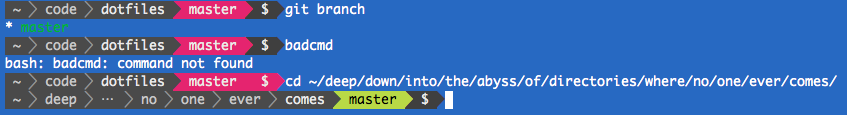

# Powerline shell

[Powerline Shell](https://github.com/b-ryan/powerline-shell) es un generador de _prompts_ bonitos y útiles para distintas _shells_.



## Instalación

Instalamos el paquete Python que da soporte a Powerline:

```console
pip install powerline-shell
```

Añadimos las configuraciones del prompt:

```console
curl -fL https://raw.githubusercontent.com/sdelquin/pro/main/ut0/files/powerline-bash >> ~/.bashrc
```

## Activación

Recargamos las modificaciones para visualizar el nuevo prompt:

```console
source ~/.bashrc
```
