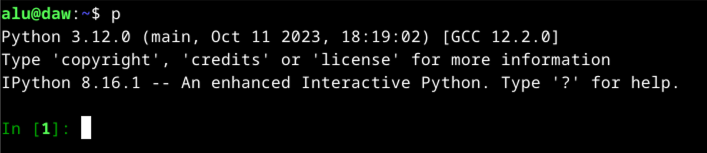
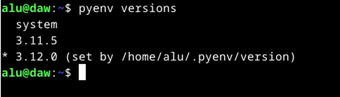
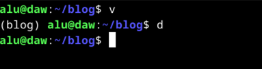
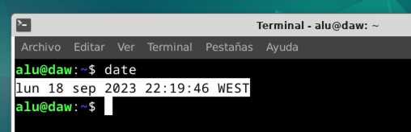
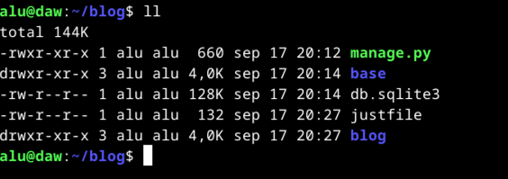
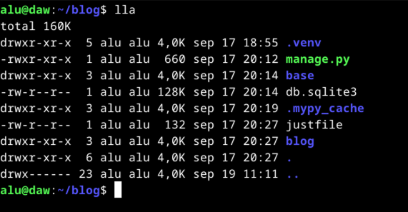
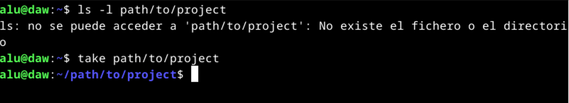
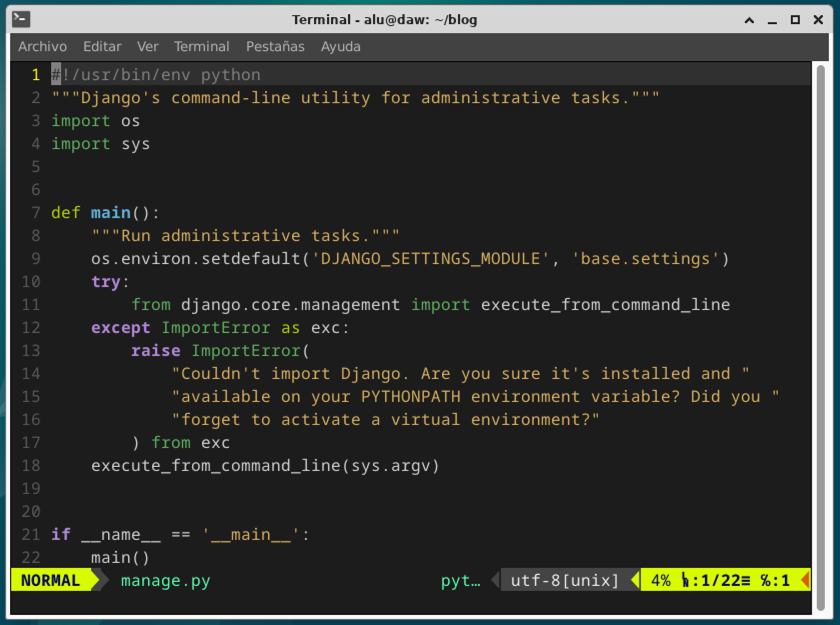

# Funcionalidades de la máquina virtual

## Python

Abrir intérprete interactivo de Python (`ipython`):

```console
$ p
```



### Pyenv

La gestión de las distintas versiones de Python se realiza a través de la herramienta [pyenv](https://github.com/pyenv/pyenv). Esto facilita la instalación de versiones antiguas o modernas del lenguaje aislando cada una del sistema operativo.



### Entornos virtuales

Activar el entorno virtual:

```console
$ cd <ruta/al/proyecto>
$ v
```

Desactivar el entorno virtual:

```console
$ cd <rutal/al/proyecto>
$ d
```

Ejemplo:



### pytest

Tenemos ya instalado el paquete [pytest](https://docs.pytest.org/en/7.1.x/getting-started.html) de forma global para lanzar nuestros tests:

```console
$ pytest
```

## Copiar y pegar

> Ya está habilitado el portapapeles bidireccional entre la máquina real y la máquina virtual.

Para copiar desde la terminal **basta con seleccionar texto**:



También es posible **copiar el contenido de cualquier fichero** desde línea de comandos con el siguiente comando:

```console
$ copy <fichero>
```

La copia también **funciona si usamos "pipes"** en línea de comandos:

```console
$ cat setup.sh | copy
```

## Manejo de ficheros

Listado de **todos los ficheros con detalles y tamaños en unidades "humanas"** ordenados de más reciente a menos reciente modificación:

```console
$ ll
```



Listado de **todos los ficheros (también ocultos) con detalles y tamaños en unidades "humanas"** ordenados de más reciente a menos reciente modificación:

```console
$ lla
```



Es posible **crear una carpeta y moverse a ella** (todo en uno) utilizando el siguiente comando:

```console
$ take <nueva/ruta>
```



## Visual Studio Code

**Abrir cualquier proyecto** en Visual Studio Code:

```console
$ cd <ruta/al/proyecto>
$ e
```

> 💡 `e` es un alias para `code .`

En Visual Studio Code están ya configurados los siguientes **componentes Python**:

- [Ruff](https://github.com/astral-sh/ruff): analizador de código Python.
- [Black](https://github.com/psf/black): autoformateador de código Python.
- [Mypy](https://mypy-lang.org/): verificador de tipos estáticos.
- [Django](https://github.com/vscode-django/vscode-django): sintaxis y ayudas con Django.

## Vim

El editor [Vim](https://www.vim.org/) está ya configurado con los siguientes **plugins**:

- [Vim Airline](https://github.com/vim-airline/vim-airline): Barra de estado super vitaminada.
- [Ctrlp](https://github.com/kien/ctrlp.vim): Navegador de ficheros de acceso rápido.
- [Tema PaperColor](https://github.com/NLKNguyen/papercolor-theme): Tema de color.



Igualmente se han preparado algunos **comandos útiles**:

- `dl`: duplicar la línea actual.
- `vv`: seleccionar la línea actual.
- `Ctrl-y`: copiar la selección al portapapeles.
- `a`: copiar la selección justo debajo del cursor.

## Herramientas

Las siguientes herramientas ya vienen preinstaladas en la máquina:

- [just](https://github.com/casey/just): Herramienta para poder ejecutar comandos predefinidos en proyectos (_makefiles_).
- [bat](https://github.com/sharkdp/bat): Es como "cat" pero que mola. ¡Pruébalo!
- [sqlite3](https://www.sqlite.org/index.html): Herramienta cliente en línea de comandos para manejar bases de datos de tipo sqlite.
- [postgresql](https://www.postgresql.org/): Sistema gestor de bases de datos.
- [redis](https://redis.io/): almacenamiento clave-valor en memoria.
- [liferea](https://github.com/lwindolf/liferea): cliente RSS.
