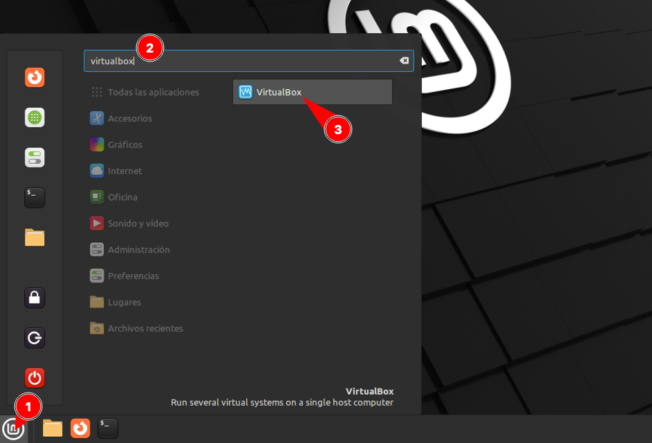
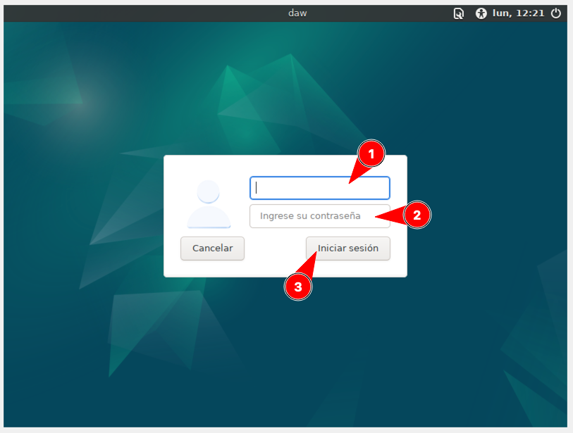
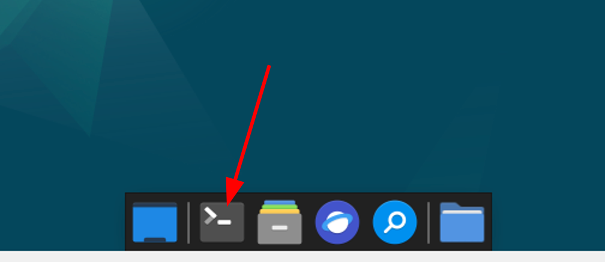
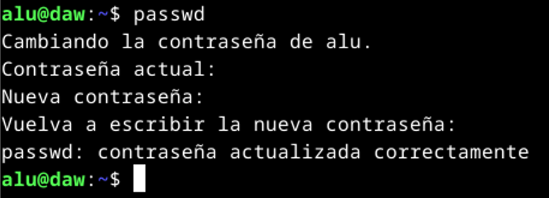

# Configuración de la máquina virtual

Esta sección explica cómo montar **la máquina virtual** con la que vamos a trabajar en el módulo.

## Descarga e instalación

Abrimos una terminal **desde la máquina real**:


Construimos la máquina virtual con el siguiente comando:

```console
curl -L https://raw.githubusercontent.com/sdelquin/edubase/main/scripts/build-vm.sh | bash
```

> ⚠️ Este proceso puede durar varios minutos. ¡Paciencia!

Ajustamos los parámetros de la interfaz de red con el siguiente comando:

```console
curl -L https://raw.githubusercontent.com/sdelquin/edubase/main/scripts/fix-network.sh | bash
```

## Arranque y configuración

Ahora abrimos VirtualBox:



Debería aparecer **una nueva máquina virtual con el nombre del módulo**. Arrancamos esta máquina:


En pocos segundos nos aparecerá la **ventana de login**:



Accedemos al sistema con las siguientes credenciales:

- Usuario: `alu`
- Contraseña: `tranquilidad`

A continuación abrimos una terminal **desde la máquina virtual**:



Ahora ejecutamos lo siguiente:

```console
curl -L https://raw.githubusercontent.com/sdelquin/edubase/main/scripts/set-hostname.sh | bash
```

> ⚠️ Cuando nos lo solicite tendremos que poner la contraseña (ojo porque no se ve cuando la escribimos).

A continuación lanzamos el siguiente comando:

```console
curl -L https://raw.githubusercontent.com/sdelquin/edubase/main/scripts/create-folders.sh | bash
```

## Clave de acceso

Por último **modificamos la contraseña** que está por defecto para el usuario `alu` poniendo otra distinta QUE NO DEBEMOS OLVIDAR.

Para ello ejecutamos el comando `passwd`:



## Pasos posteriores

1. La primera vez que entramos a la máquina virtual puede que no se vea ocupando completamente la pantalla. Esto lo resolvemos muy fácil:


2. Abre una terminal y lanza el siguiente comando para comprobar que tu IP se corresponde con la que debe. Ejemplo: Si estás en el aula 103 y tu número de PC es el 12, el comando debería dar como salida: `10.103.12.20`

```console
ip -br a | perl -nle 'print $1 if /(10.[^\/]+)/'
```

> 💡 Si la IP que saca el comando no es la que corresponda, avisa al profe.

3. No instales otra shell que no sea la que viene por defecto `bash` ya que puede afectar a las configuraciones predefinidas.
