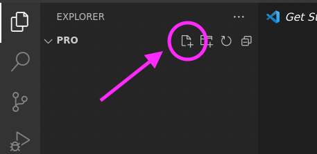
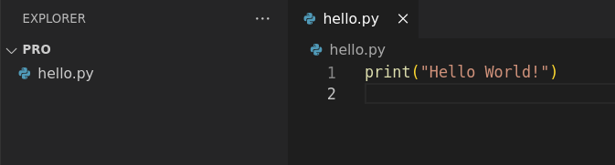
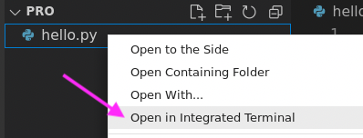
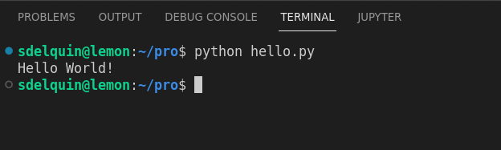

# Visual Studio Code

## Instalación

Descargamos la última versión disponible de VSCode en una carpeta temporal:

```console
curl -fLo /tmp/vscode.deb "https://code.visualstudio.com/sha/download?build=stable&os=linux-deb-x64"
```

Comprobamos que el paquete se haya descargado correctamente:

```console
file /tmp/vscode.deb
```

→ `vscode.deb: Debian binary package (format 2.0), with control.tar.xz, data compression xz`

Instalamos el paquete:

```console
sudo apt install -y /tmp/vscode.deb
```

Comprobamos que la instalación ha sido satisfactoria:

```console
code --version
```

→ `1.71.1`  
→ `e7f30e38c5a4efafeec8ad52861eb772a9ee4dfb`  
→ `amd64`

> 💡 &nbsp;Es posible que tengas pequeñas diferencias en la versión. ¡No te preocupes!

## Preparación para desarrollo Python

Debemos instalar ciertas extensiones y personalizar la configuración de Visual Studio Code para que nos permita trabajar de forma cómoda con Python.

### Instalación de extensiones

```console
code --install-extension ms-python.python
```

### Configuraciones

Descargamos (e instalamos) las [configuraciones personalizadas](files/settings.json) para Visual Studio Code:

```console
curl -fLo ~/.config/Code/User/settings.json https://raw.githubusercontent.com/sdelquin/pro/main/ut0/files/settings.json
```

## Apertura de la aplicación

Para probar que todo ha ido bien y que podemos editar ficheros sin dificultad, podemos lanzar la aplicación VSCode:

```console
cd ~/pro && code .
```

> Es posible que VSCode nos pregunte la primera vez si confiamos en la ubicación que estamos abriendo. Marcar que sí y continuar.

## Lanzando nuestro primer programa

Creamos un fichero en VSCode pulsando el botón correspondiente y lo llamamos `hello.py`:



Escribimos este código:



Pulsamos botón derecho sobre el nombre del fichero en el explorador y abrimos una **terminal**:



Desde la terminal lanzamos nuestro programa escribiendo: `python hello.py`:



## Por si algo va mal

En el caso de que VSCode funcione de manera incorrecta o se cierre inesperadamente, se puede encontrar información en sus "logs" dentro de la carpeta `~/.config/Code/logs`

Si por lo que fuera, necesitamos "matar" el proceso, podemos hacerlo de la siguiente manera:

```console
killall code
```
