# Instalación de git en Windows

Lo primero es descargar el [instalador de git](https://git-scm.com/download/win) desde su página oficial:

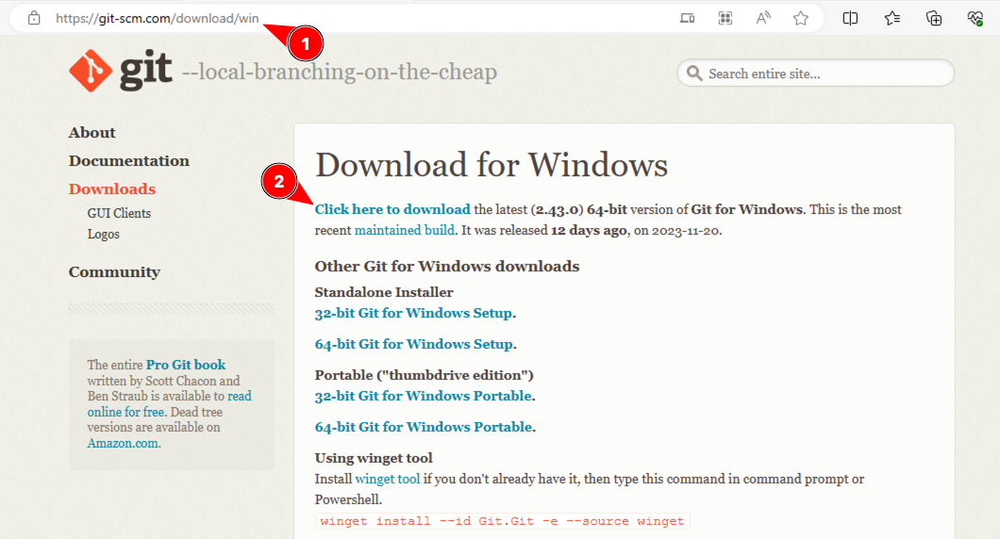

Puede que aparezca un mensaje de seguridad. Conservamos el archivo:

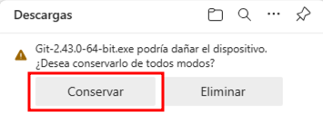

Lo más habitual es que el fichero se haya guardado en la carpeta de _Descargas_. Lo buscamos en el explorador de archivos y hacemos doble clic sobre el archivo:

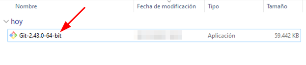

Si aparece una pantalla de seguridad podemos ejecutar con normalidad:

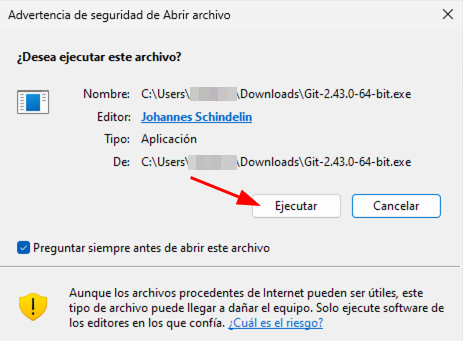

Dado que esta aplicación hace modificaciones a nivel de sistema operativo es bastante probable que tengamos que permitir cambios en el dispositivo:

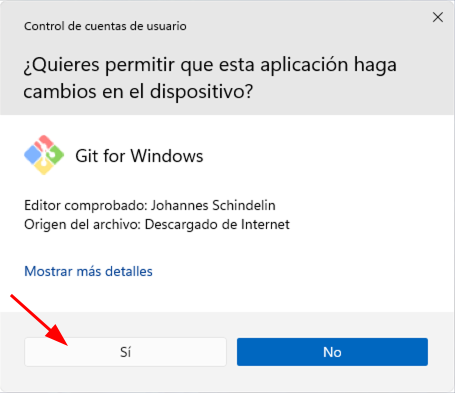

Ahora sí que se nos abre el instalador y lo primero es aceptar la licencia [GNU General Public License, version 2](https://www.gnu.org/licenses/old-licenses/gpl-2.0.html):

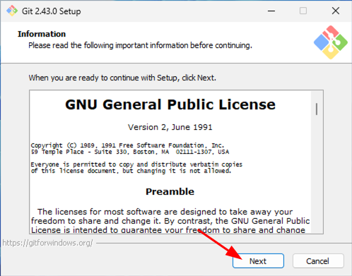

Lo siguiente será la ubicación de la instalación. Dejamos el valor por defecto y continuamos:

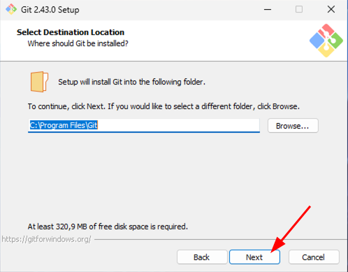

En la siguiente pantalla tendremos que seleccionar los componentes a instalar. Dejamos los valores por defecto y continuamos:

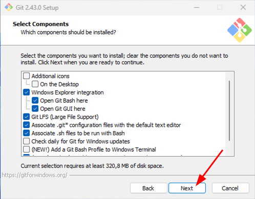

A continuación debemos seleccionar el menú en el que se guardarán los accesos directos. Dejamos los valores por defecto y continuamos:

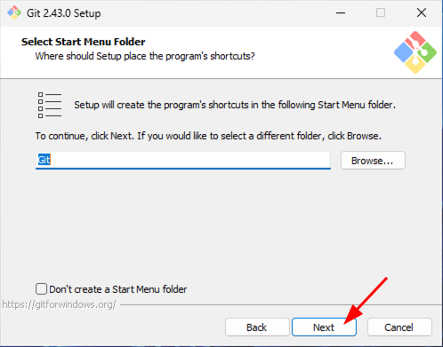

En la siguiente pantalla debemos seleccionar el editor por defecto para _git_. En este caso elegimos "Notepad" y continuamos:

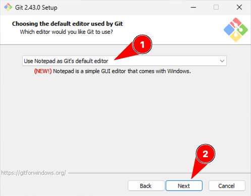

Ahora debemos especificar cuál será la rama por defecto cuando creemos nuevos repositorios _git_ vacíos. En este caso **vamos a cambiar la opción** por defecto y continuamos:

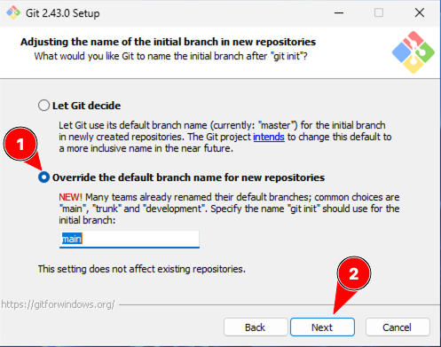

A continuación nos pide indicar la gestión del `PATH`. Dejamos los valores por defecto y continuamos:

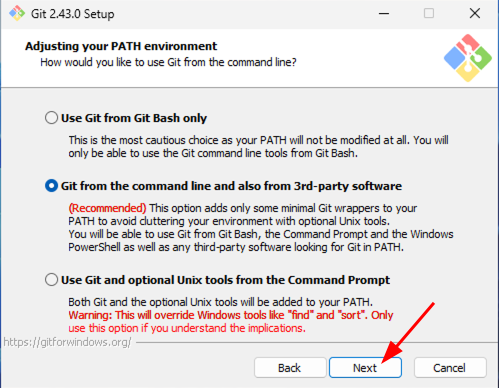

En la siguiente pantalla nos solicita elegir el ejecutable para _OpenSSH_. Dejamos los valores por defecto y continuamos:

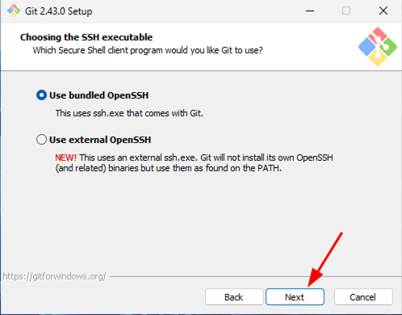

Relacionado con lo anterior, también debemos especificar las librerías para comunicación SSL. Igualmente a lo anterior, aquí también dejamos los valores por defecto y continuamos:

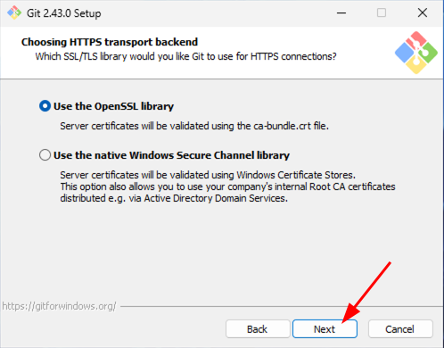

A continuación tendremos que especificar la manera de gestionar los saltos de línea en los archivos. Dejamos los valores por defecto y continuamos:

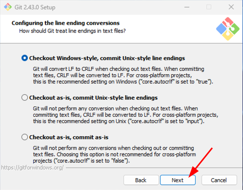

En la siguiente pantalla hay que configurar el emulador de terminal para usar con _git_. Dejamos los valores por defecto y continuamos:

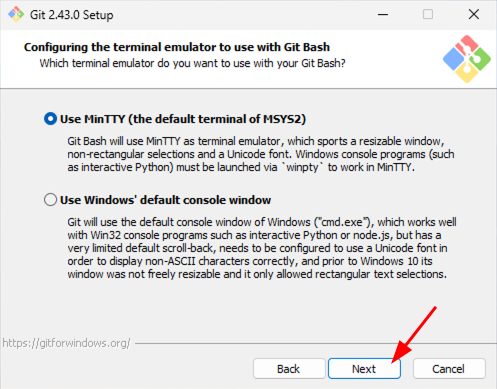

A continuación hay que especificar el comportamiento por defecto de `git pull`. Dejamos los valores por defecto y continuamos:

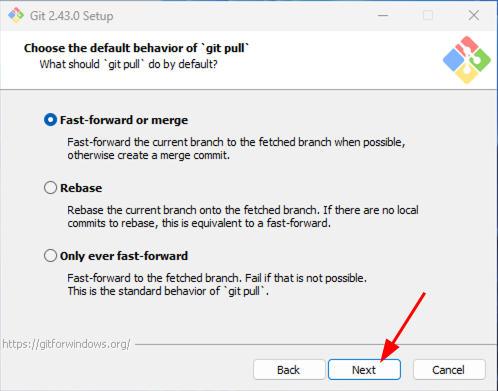

En la siguiente pantalla nos preguntan por el sistema de gestión de credenciales para _git_. Dejamos los valores por defecto y continuamos:

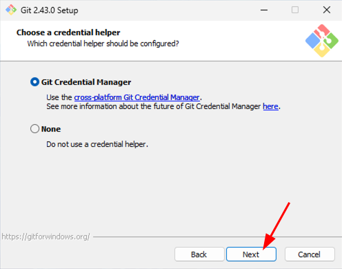

En la configuración de las opciones adicionales también dejamos los valores por defecto y continuamos:

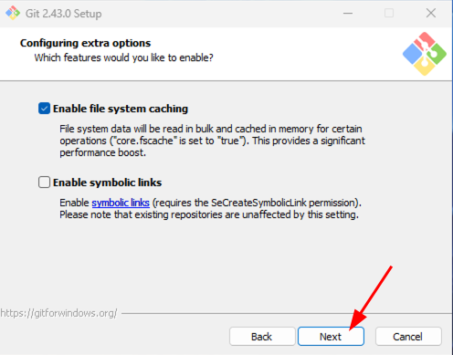

En la siguiente pantalla de opciones experimentales no seleccionamos nada. Dejamos los valores por defecto y continuamos:

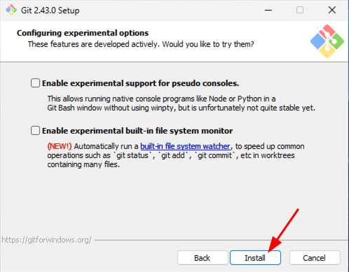

El proceso de instalación comenzará mostrando una barra de progreso con las herramientas que se están almacenando:

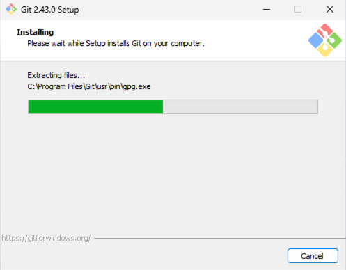

Llegamos al final de la instalación. En esta pantalla desmarcamos las opciones y finalizamos:

Para comprobar que tenemos `git` bien instalado, abrimos una ventana de "Símbolo del sistema":

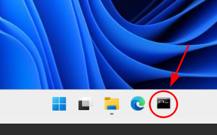

Y lanzamos el comando `git --version`:

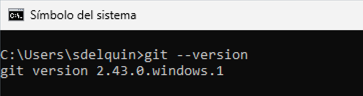

Si vemos una salida similiar (obviamente la versión puede cambiar) es que **la instalación ha sido exitosa**.
