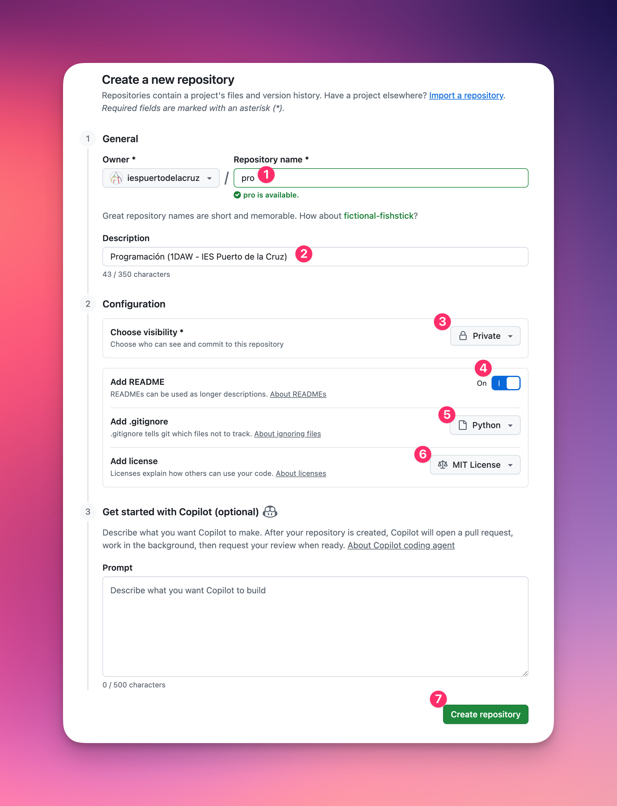

# Configuración de GIT

Un **sistema de control de versiones** como `git` sirve para gestionar y registrar los cambios realizados en archivos o proyectos, permitiendo rastrear su historial y recuperar versiones anteriores si es necesario. Además, facilita el trabajo en equipo al permitir que múltiples desarrolladores trabajen en paralelo en el mismo proyecto sin conflictos, integrando sus contribuciones de manera eficiente.

## Creación de una cuenta GitHub

**GitHub** es una plataforma online que permite alojar repositorios de `git`, facilitando la colaboración en proyectos de software y el seguimiento de versiones de forma remota. Además, ofrece herramientas adicionales como seguimiento de problemas, integración continua y gestión de proyectos para equipos de desarrollo.

Si aún no tienes una cuenta GitHub **debes crearte una** accediendo a: https://github.com/signup

## Repositorio

Un repositorio es un espacio donde se almacena un proyecto y su historial de cambios, permitiendo gestionar, compartir y colaborar en el código fuente o archivos relacionados.

Lo primero será crear el repositorio para trabajar en el módulo. Accede a https://github.com/new y cumplimenta los siguientes apartados:

Ten en cuenta:

| Matriculado en... | Repository name | Description                                                       |
| ----------------- | --------------- | ----------------------------------------------------------------- |
| 1DAW (PRO)        | `pro`           | Programación (1DAW - IES Puerto de la Cruz)                       |
| 2DAW (DSW)        | `dsw`           | Desarrollo web en entorno servidor (2DAW - IES Puerto de la Cruz) |



## Generar token de acceso

Un [token de acceso personal](https://docs.github.com/es/authentication/keeping-your-account-and-data-secure/managing-your-personal-access-tokens) es una clave generada que permite autenticarte y realizar acciones en tus repositorios (como clonar, empujar cambios o gestionar configuraciones) de manera segura, reemplazando el uso de contraseñas en la línea de comandos o scripts.

Para **generar un token de acceso personal** en GitHub debes ir a https://github.com/settings/tokens/new y rellenar lo siguiente:

> ⚠️ En la **fecha de expiración** pon la fecha en la que acaba el curso.


Te aparecerá ahora la siguiente pantalla en la que debes pulsar el botón para copiar el token.

**GUARDA EL TOKEN EN UN SITIO SEGURO PORQUE NUNCA MÁS VOLVERÁ A APARECER**


## Almacenar el token GitHub de forma permanente

Para no tener que introducir cada vez las credenciales de GitHub en la terminal, vamos a configurarlo de forma permanente.

Para ello debes abrir una terminal de tu máquina virtual y ejecutar el siguiente comando:

```console
git config --global credential.helper store
```

## Clonar el repositorio

Para poder clonar el repositorio de clase en tu máquina virtual debes abrir una terminal y ejecutar el siguiente comando:

```console
git clone https://github.com/tu-usuario/tu-repositorio.git
```

Notas:

- Sustituye `tu-usuario` por tu usuario de GitHub.
- Sustituye `tu-repositorio` por:
  - `pro` (si estás cursando PRO).
  - `dsw` (si estás cursando DSW).

Este comando solicita dos credenciales:

- El **Username** es tu **nombre de usuario** de GitHub.
- El **Password** es tu **token de acceso personal** de GitHub.

## Establecer identidad

Para que `git` conozca quiénes somos a la hora de realizar cambios en el código, debemos indicarlo mediante los siguientes comandos:

```console
git config --global user.email "tu-email"
```

Sustituye `tu-email` por el email que has utilizado en la cuenta de GitHub.

```console
git config --global user.name "Tu nombre y apellidos"
```

Sustituye `Tu nombre y apellidos` por tu **nombre y apellidos**.
