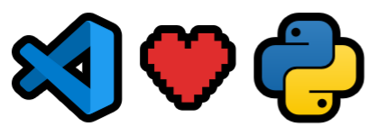

# VSCode ❤️ Python

Dejo por aquí mi configuración de [Python](https://www.python.org/) para [VSCode](https://code.visualstudio.com/).



## Extensiones

Sólo necesito dos extensiones: **Ruff & Mypy**.

### ✨ Ruff

[Ruff](https://docs.astral.sh/ruff/) es un analizador y autoformateador de código Python. Es extremadamente rápido y reúne varias herramientas en una, lo que lo convierte en un recurso muy apreciado.

**Configuración**:

1. Instalar [esta extensión](https://marketplace.visualstudio.com/items?itemName=charliermarsh.ruff) para VSCode.
2. Copiar la siguiente configuración:

```toml
line-length = 100
extend-select = ["Q"]
exclude = ["migrations"]

[flake8-quotes]
inline-quotes = "single"

[format]
quote-style = "single"
```

3. Pegarla en un archivo de configuración en función de tu sistema operativo (_sustituye "alice" por tu nombre de usuario_):

| S.O.    | Fichero                                                   |
| ------- | --------------------------------------------------------- |
| Windows | `C:\Users\Alice\AppData\Roaming\ruff\ruff.toml`           |
| Linux   | `/home/alice/.config/ruff/ruff.toml`                      |
| macOS   | `/Users/Alice/Library/Application Support/ruff/ruff.toml` |

> 💡 Puede que las carpetas no estén creadas y tengas que hacerlo.

→ Documentación: https://docs.astral.sh/ruff/faq/#how-can-i-change-ruffs-default-configuration

### ✨ Mypy

[Mypy](https://mypy-lang.org/) es una herramienta de verificación estática de tipos para Python que ayuda a detectar y prevenir errores relacionados con el tipo de datos en el código.

**Configuración**:

1. Instalar [esta extensión](https://marketplace.visualstudio.com/items?itemName=ms-python.mypy-type-checker) para VSCode.
2. Copiar la siguiente configuración:

```ini
[mypy]
disable_error_code = assignment, var-annotated, import
explicit_package_bases = True
```

3. Pegarla en el archivo de configuración `$HOME/.config/mypy/config`

> 💡 Puede que las carpetas no estén creadas y tengas que hacerlo.

→ Documentación: https://mypy.readthedocs.io/en/stable/config_file.html#the-mypy-configuration-file

## Configuración VSCode

Añadir estas líneas al fichero de configuración de VSCode → _Preferences: Open User Settings (JSON)_:

```json
  "python.analysis.ignore": ["*"],
  "mypy-type-checker.preferDaemon": false,

  "[python]": {
    "editor.formatOnSave": true,
    "editor.defaultFormatter": "charliermarsh.ruff",
    "editor.codeActionsOnSave": {
      "source.organizeImports": true,
      "source.fixAll": true
    }
  },
```

Ubicaciones del archivo de configuración de VSCode según el sistema operativo:

| S.O.    | Fichero                                                      |
| ------- | ------------------------------------------------------------ |
| Windows | `%APPDATA%\Code\User\settings.json`                          |
| Linux   | `$HOME/.config/Code/User/settings.json`                      |
| macOS   | `$HOME/Library/Application\ Support/Code/User/settings.json` |

→ Documentación: https://code.visualstudio.com/docs/getstarted/settings#_settings-file-locations

**🎉 Happy Python Coding!**
