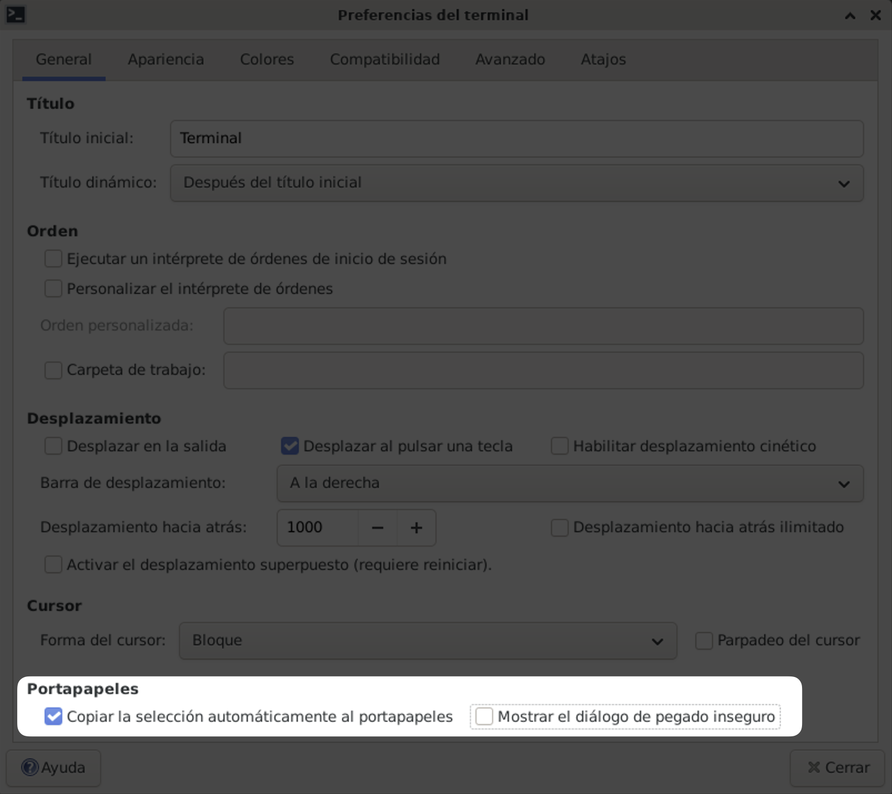

# Pasos posteriores a la instalación

## Usuario `alu`

```console
sudo adduser alu
```

## Herramientas varias

```console
sudo apt install -y curl git tree xclip \
                    psmisc zip fonts-noto-color-emoji \
                    bat sqlite3 postgresql redis poedit
```

## uv

```console
curl -LsSf https://astral.sh/uv/install.sh | sh
```

## just

```console
curl --proto '=https' --tlsv1.2 -sSf https://just.systems/install.sh | bash -s -- --to ~/.local/bin
```

## Node

Primero se instala [NVM](https://www.nvmnode.com/es/):

```console
curl -o- https://raw.githubusercontent.com/nvm-sh/nvm/v0.40.3/install.sh | bash
```

Y ahora se instala Node:

```console
nvm install --lts
```

## Vim

Por defecto ya existe un `vi` instalado pero no es la versión «completa». Para disponer de [vim](https://es.wikipedia.org/wiki/Vim) hay que hacer:

```console
sudo apt install -y vim
```

### Configuración

Configuraciones básicas de vim → [.vimrc](files/.vimrc)

```console
curl -fLo ~/.vimrc https://raw.githubusercontent.com/sdelquin/edubase/main/docs/files/.vimrc
```

Enlazar la configuración de vim para que funcione igual con `root`. Ejecutar (como `root`) lo siguiente:

```console
ln -sf /home/alu/.vimrc /root/.vimrc
```

## `.bashrc`

Configuraciones a nivel de usuario → [.bashrc](files/.bashrc)

```console
curl -fLo ~/.bashrc https://raw.githubusercontent.com/sdelquin/edubase/main/docs/files/.bashrc &&
source ~/.bashrc
```

## VSCode

Instalación de Visual Studio Code:

```console
curl -L 'https://code.visualstudio.com/sha/download?build=stable&os=linux-deb-x64' -o /tmp/code.deb
sudo apt install -y /tmp/code.deb
rm /tmp/code.deb
```

### Configuración

Para fijar la configuración de VSCode ejecutamos lo siguiente:

```console
curl -fLo ~/.config/Code/User/settings.json https://raw.githubusercontent.com/sdelquin/edubase/main/docs/files/settings.json
```

### Extensiones

Podemos instalar las extensiones necesarias de VSCode desde línea de comandos:

```console
code --install-extension batisteo.vscode-django --install-extension mrorz.language-gettext --install-extension skellock.just --install-extension bierner.markdown-preview-github-styles --install-extension fabiospampinato.vscode-open-in-github --install-extension esbenp.prettier-vscode --install-extension charliermarsh.ruff --install-extension astral-sh.ty --install-extension vscode-icons-team.vscode-icons
```

#### Ruff

Añadir su configuración:

```console
mkdir -p ~/.config/ruff
curl -fLo ~/.config/ruff https://raw.githubusercontent.com/sdelquin/edubase/main/docs/files/ruff.toml
```

#### Ty

Añadir su configuración:

```console
mkdir -p ~/.config/ty
curl -fLo ~/.config/ty https://raw.githubusercontent.com/sdelquin/edubase/main/docs/files/ty.toml
```

## Ajustes terminal

Los siguientes ajustes (_preferencias_) son interesantes para facilitar el flujo de trabajo en la aplicación de Terminal para el portapapeles:



## Traductor

Vamos a instalar este [traductor en línea de comandos](https://github.com/soimort/translate-shell) que puede ser de mucha utilidad.

Primero instalamos sus dependencias:

```console
sudo apt install -y gawk
```

Y ahora descargamos e instalamos la aplicación:

```console
curl -sfL git.io/trans |
sudo tee /usr/local/bin/trans > /dev/null && \
sudo chmod +x /usr/local/bin/trans
```

### Usando las traducciones

No es necesario que ejecutes los siguientes comandos, sólo te permiten tener una idea de cómo utilizar el traductor.

**Traducir del inglés al español**

```console
$ trans hello
hello
/həˈlō/

Hola

Traducciones de hello
[ English -> Español ]

hello
    Hola
```

**Traducir del español al inglés**

```console
$ trans :en hola
hola

hello

Traducciones de hola
[ Español -> English ]

hola
    hello
```
