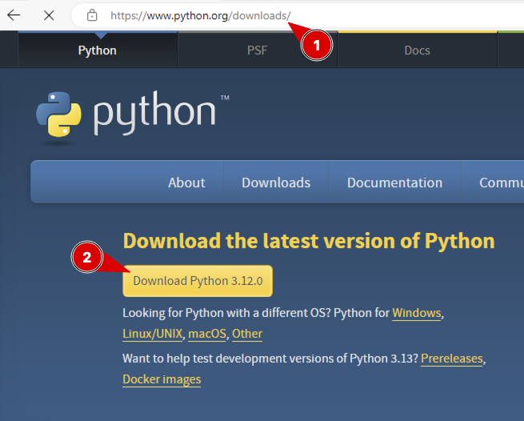
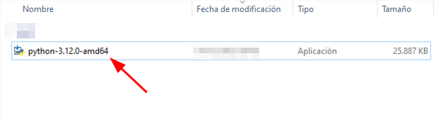
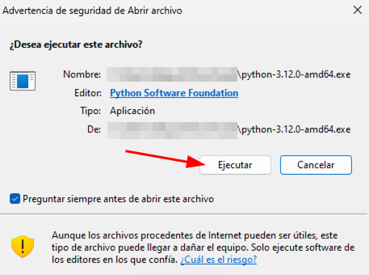
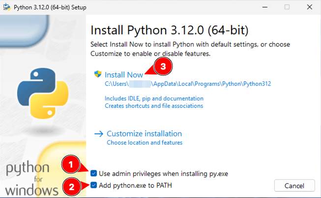
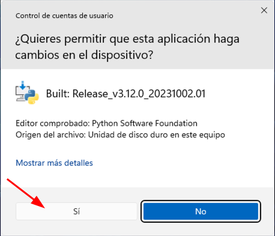
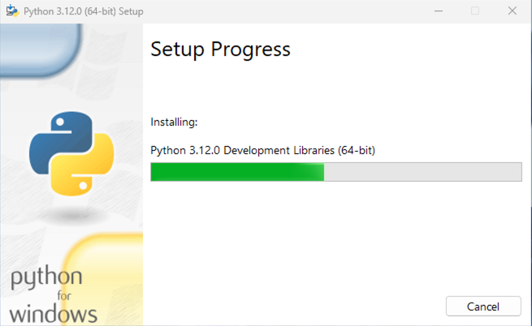
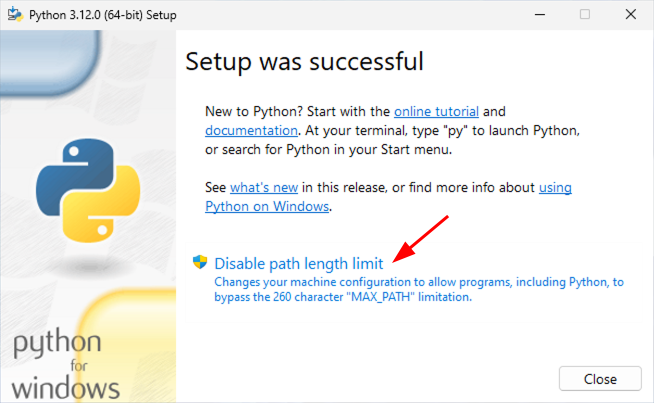
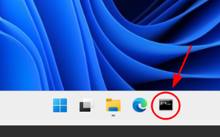
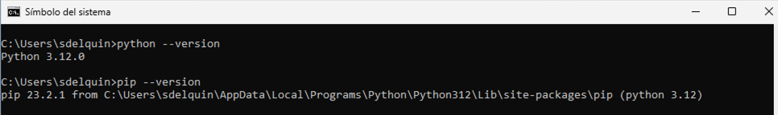

# Instalación de Python en Windows

A continuación se muestra un **tutorial para instalar la última versión estable de Python sobre Windows.**

---

Lo primero es descargar [la última versión estable de Python](https://www.python.org/downloads/) para Windows:

Ahora lanzamos el instalador haciendo doble clic en el fichero descargado (habitualmente en la carpeta _Descargas_):

Habrá que aceptar la pregunta de seguridad que los abre el sistema operativo:

Marcamos las siguientes opciones y empezamos la instalación:

Al estar instalando a nivel administrador necesitamos permitir que se hagan cambios en el dispositivo:

Aparecerá una barra de progreso con las distintas herramientas que se deben instalar:

Para finalmente terminar la instalación con una pantalla similar a la siguiente:

> 💡 Si, como en el caso anterior, nos aparece la opción de _"Disable path length limit"_ pulsamos ahí para evitar la limitación de longitud de rutas de ficheros.

Para comprobar que todo se ha instalado correctamente, abrimos un "Símbolo del sistema":

Y ahora lanzamos estos comandos:

Si la salida es similar a la que aparece en pantalla es que todo ha ido bien.
