# Sincronización de la carpeta de trabajo

✨ El objetivo de esta guía es indicar los pasos necesarios para poder **sincronizar la carpeta de trabajo** que usamos en el equipo de clase con tu equipo de casa.

Esta guía se basa en sincronizar la carpeta `pro` de la ruta base de usuario (`$HOME` en Linux y `%USERPROFILE%` en Windows) pero se puede aplicar exactamente igual si la carpeta fuera otra cualquiera.

## Tabla de contenidos

[Syncthing en clase](#-syncthing-en-clase)  
[Syncthing en casa](#-syncthing-en-casa)  
[Vinculando clase desde casa](#vinculando-clase-desde-casa)  
[Vinculando casa desde clase](#vinculando-casa-desde-clase)  
[Sincronizar en el día a día](#sincronizar-en-el-día-a-día)  
[Ficheros de configuración](#ficheros-de-configuración)

## 🎓 Syncthing en clase

### Instalación de Syncthing

[Syncthing](https://syncthing.net/) es un servicio de sincronización de ficheros.

**→ En la máquina virtual de clase ya está instalado.**

### Configuración de Syncthing

Abrimos una terminal y lanzamos este comando:

```console
syncthing --no-default-folder
```

Veremos que aparecen muchos mensajes en la terminal y a continuación se nos abrirá una ventana en el navegador con la dirección http://127.0.0.1:8384 y con una pantalla de administración (_dashboard_) similar a esta, en la que tendremos que hacer estas tres cosas:

1. Cambiar el idioma a "Spanish".
2. Pulsar en "De acuerdo" porque no necesitamos contraseña para este equipo.
3. Pulsar en la identificación del equipo.

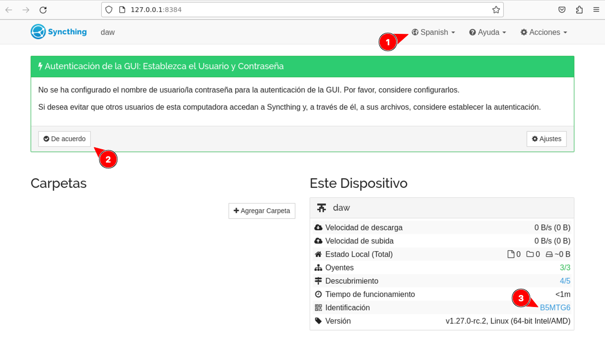

En la pantalla de identificación del equipo debemos **apuntar el identificador del equipo de clase y no perderlo**:

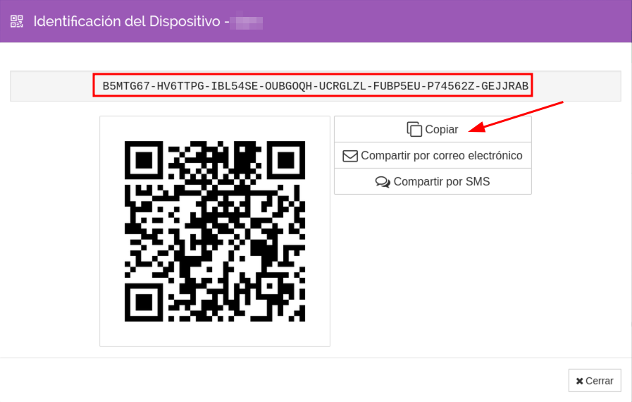

Cerramos esta pantalla y volvemos al _dashboard_ donde pulsaremos el botón para agregar una nueva carpeta:

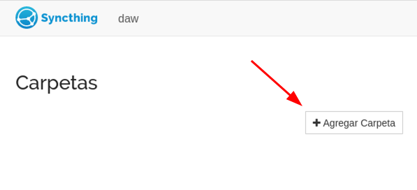

En la siguiente pantalla indicamos que queremos compartir la carpeta con identificador `pro` y que se encuentra en la ruta `~/pro`. Luego pulsamos el botón de "Guardar":

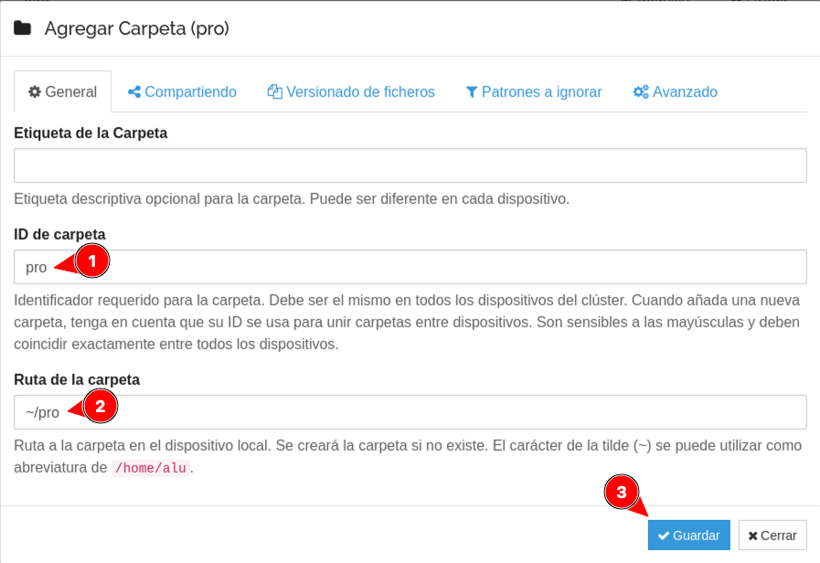

Con todo esto, la pantalla de administración nos debería quedar algo así:

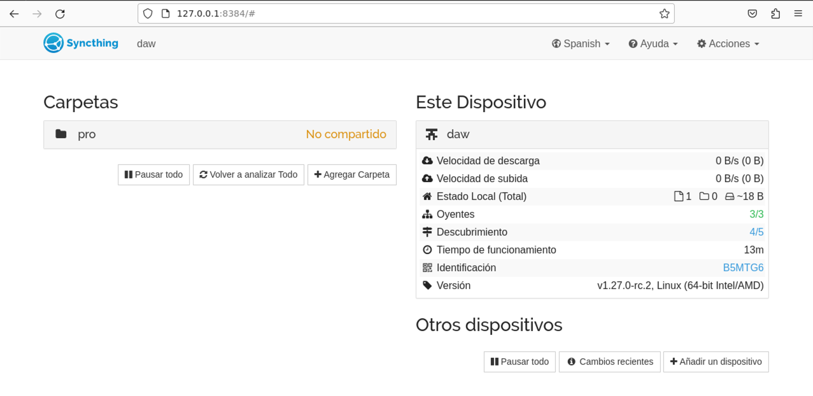

Podemos cerrar el navegador (o la pestaña de Syncthing) y en la terminal pulsar la combinación de teclas <kbd>Ctrl-C</kbd> para detener el servicio:

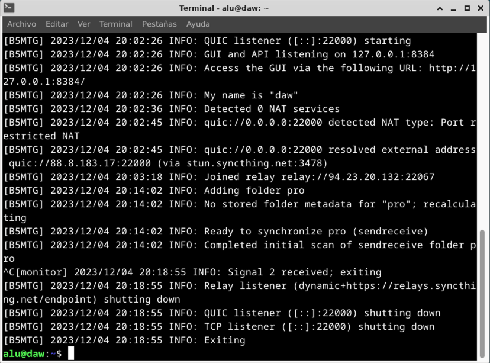

## 🏠 Syncthing en casa

> 💡 Esta sección presupone un sistema operativo 🪟 Windows en la máquina de casa.

### Instalación de Syncthing

Lo primero será descargar la herramienta desde su página web. Para ello nos vamos a esta dirección https://syncthing.net/downloads/ y descargamos la versión para Windows:

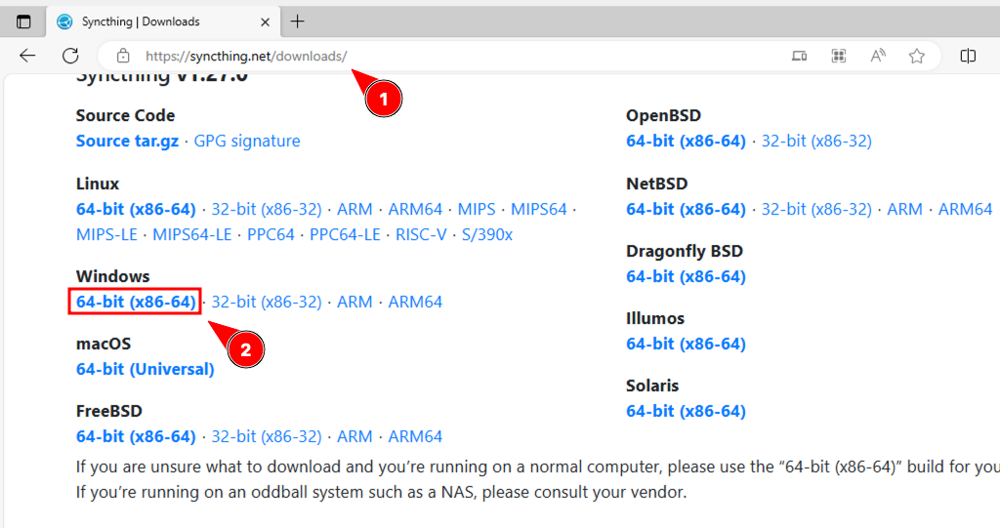

Lo más probable es que el archivo se haya descargado en la carpeta _Descargas_. Lo buscamos en un explorador de archivos y hacemos doble clic para abrir el archivo comprimido:

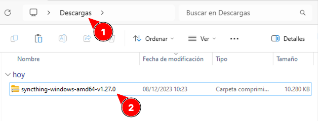

Ahora pulsamos con **botón derecho** sobre el archivo y le damos a "Copiar":

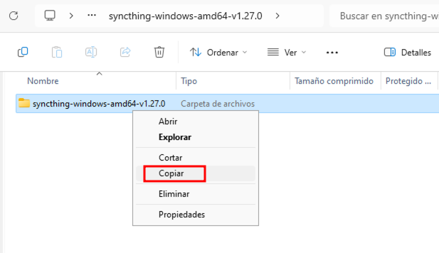

A continuación debemos ir en en explorador de archivos a la carpeta `C:\Archivos de programa` y pegar la carpeta copiada de _Syncthing_:


Ahora vamos a renombrar la carpeta y llamarla `Syncthing`:

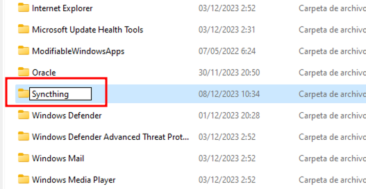

Por último pulsamos con botón derecho sobre la propia carpeta `Syncthing` para copiar su ruta completa:

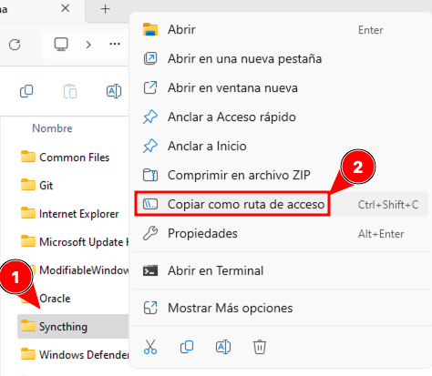

Ahora es el momento de agregar esta ruta al `PATH` del sistema para lo cual pulsamos la tecla <kbd>Win+R</kbd> y escribimos `SystemPropertiesAdvanced`:

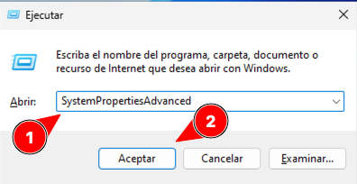

En la siguiente ventana pulsamos en "Variables de entorno":

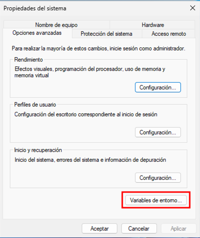

Ahora debemos seleccionar la variable del sistema `Path` y editar sus valores:

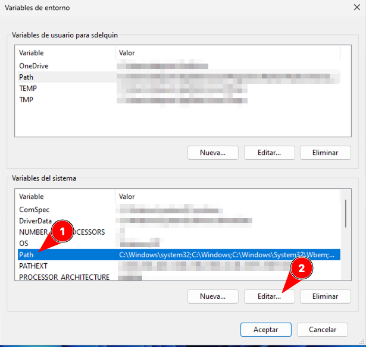

En la ventana que se nos abre debemos añadir una nueva entrada con la ruta que tenemos copiada, que en teoría debería ser `C:\Program Files\Syncthing`:

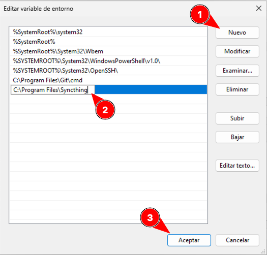

A continuación pulsamos en **Aceptar** en las **dos ventanas anteriores que teníamos abiertas**.

✨ ¡Ya tenemos instalado _Syncthing_ en nuestro sistema operativo!

### Configuración de Syncthing

Abrimos un símbolo del sistema y lanzamos este comando:

```console
syncthing --no-default-folder
```

Esto hará que se abra nuestro navegador en la dirección http://127.0.0.1:8384. Lo primero es un mensaje de envío anónimo de informes de uso. Puedes pulsar "No":

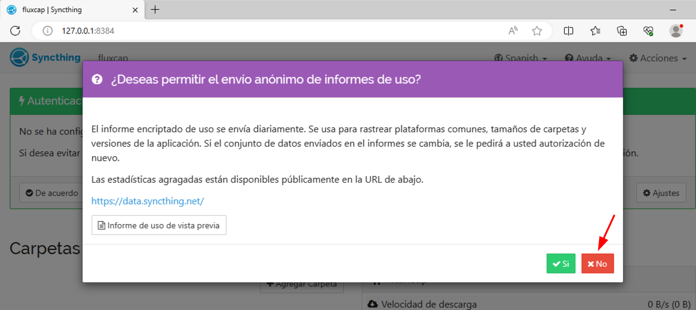

Ahora sí veremos el _dashboard_ habitual donde tendremos que hacer estas tres cosas:

1. Cambiar el idioma a "Spanish".
2. Pulsar en "De acuerdo" porque no necesitamos contraseña para este equipo.
3. Pulsar en la identificación del equipo.

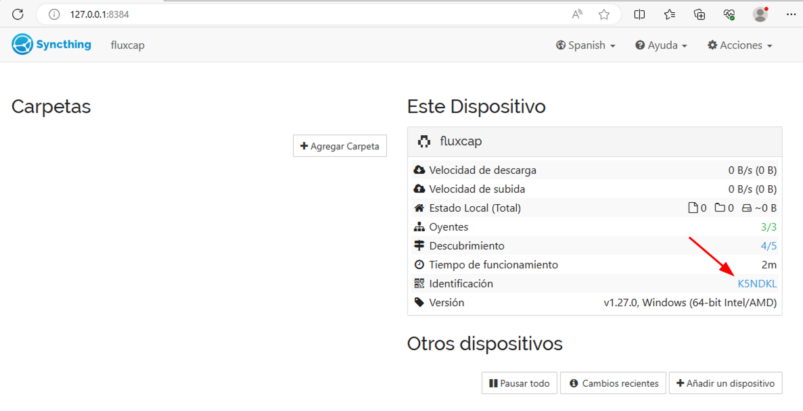

En la pantalla de identificación del equipo debemos apuntar el identificador del equipo de casa y no perderlo:

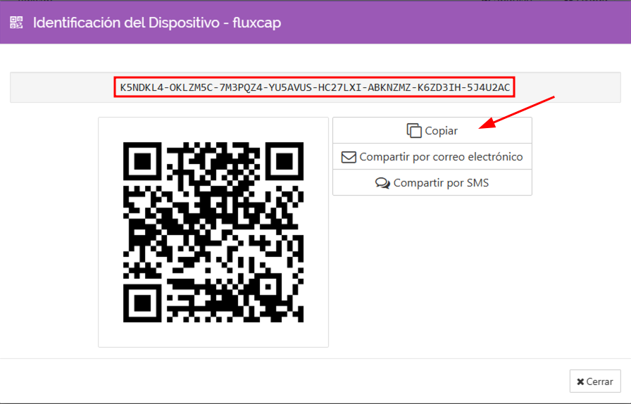

Cerramos esta pantalla y volvemos a la pantalla de inicio donde pulsaremos para agregar una nueva carpeta:

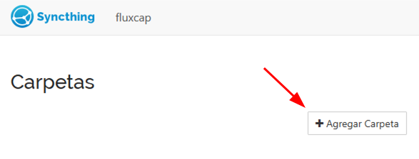

En la siguiente pantalla indicamos que queremos compartir la carpeta con identificador `pro` y que se encuentra en la ruta `~/pro`:

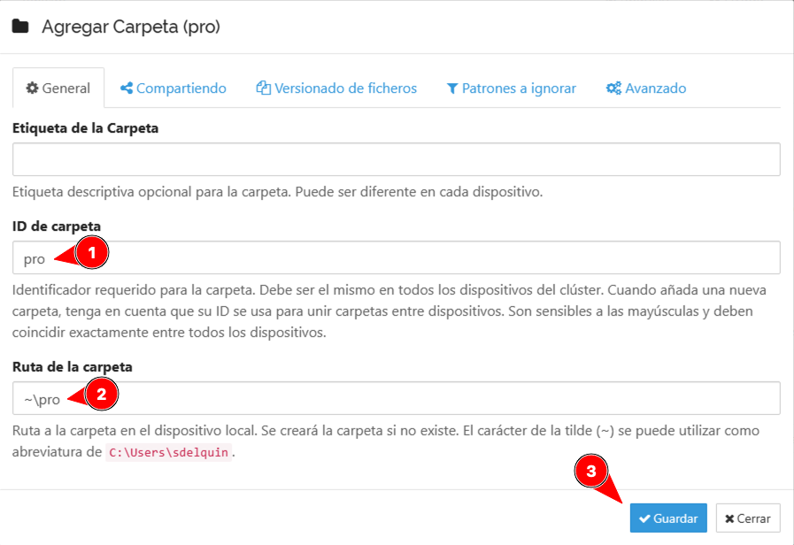

Con todo esto, la pantalla de administración nos debería quedar algo así:

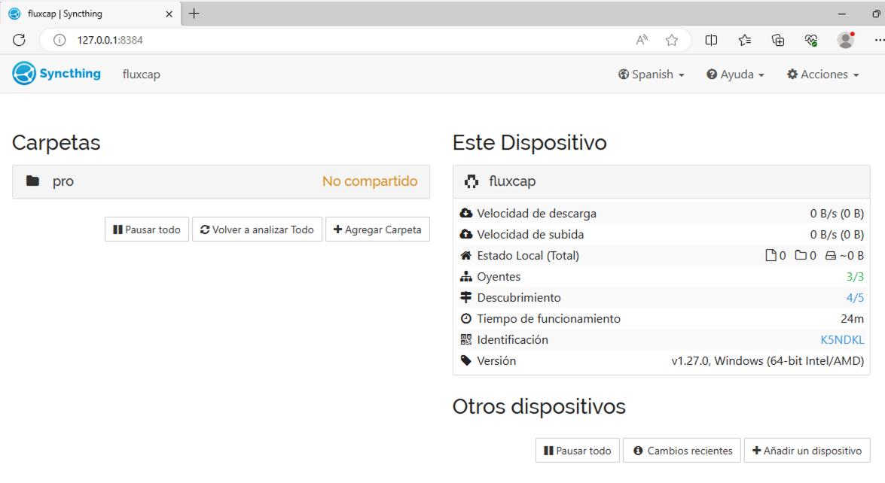

## Vinculando clase desde casa

Tendremos que **añadir un dispositivo que será el equipo de clase**. Para ello pusamos en "Añadir un dispositivo":


En la siguiente ventana indicamos el identificador del equipo de clase y escribimos como `clase` como nombre del dispositivo. Después pulsamos en la pestaña "Compartiendo":

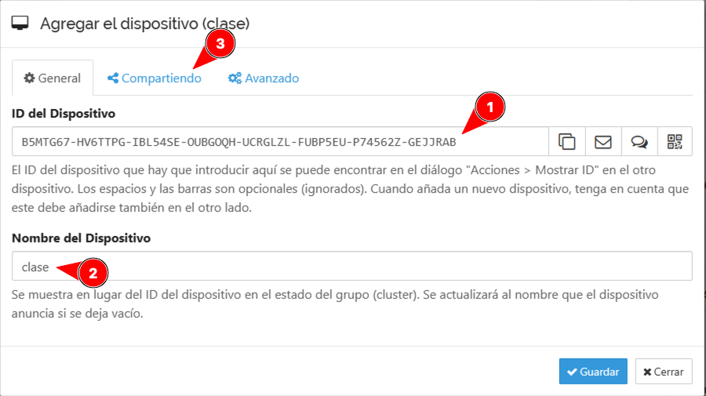

En la pestaña "Compartiendo" habilitamos la carpeta `pro` y pulsamos "Guardar":

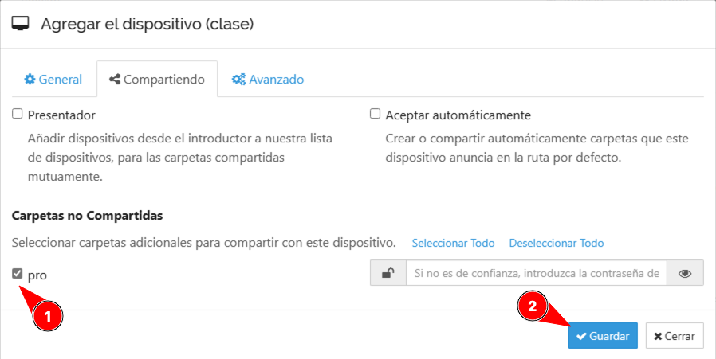

Con todo esto el _dashboard_ de _Syncthing_ debería quedar algo así:

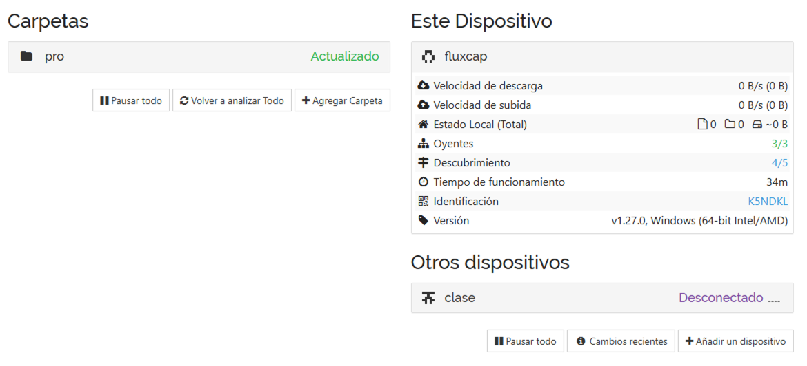

Podemos observar que el dispositivo `clase` aparece "Desconectado". Para conectarlo debemos realizar las mismas operaciones que en casa. Lo vemos en la próxima sección.

> 💡 Podemos cerrar el navegador (o la pestaña de Syncthing) y en la terminal pulsar la combinación de teclas <kbd>Ctrl-C</kbd> para detener el servicio.

## Vinculando casa desde clase

**Cuando volvamos al equipo de clase** tendremos que lanzar el servicio _Syncthing_ para vincular el equipo de casa.

Para ello lo primero será abrir una terminal y ejecutar el comando:

```console
syncthing
```

De nuevo se nos abrirá el navegador en la dirección http://127.0.0.1:8384 con el _dashboard_ y tendremos que pulsar en "Añadir un dispositivo":


En esta pantalla tendremos que añadir el ID del dispositivo de casa e indicar la etiqueta `casa`. Luego pulsamos en la pestaña "Compartiendo":

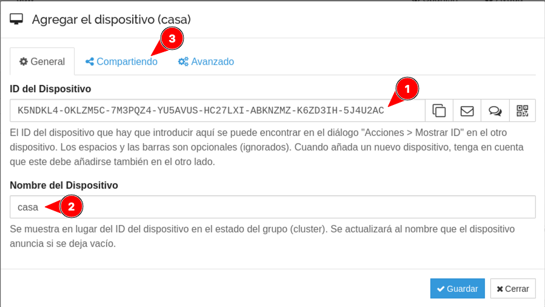

En la pestaña "Compartiendo" habilitamos la carpeta `pro` y pulsamos "Guardar":

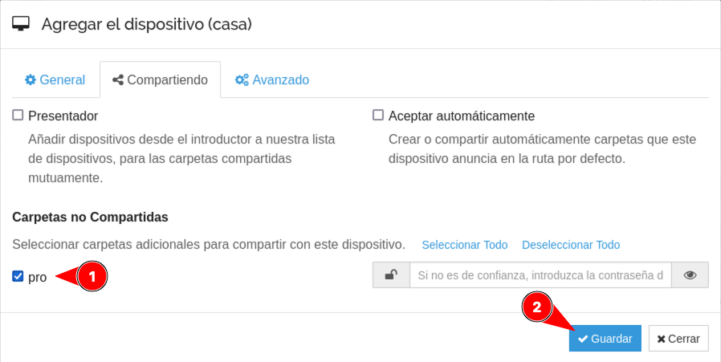

Con todo esto el _dashboard_ de _Syncthing_ debería quedar algo así:


> 💡 Podemos cerrar el navegador (o la pestaña de Syncthing) y en la terminal pulsar la combinación de teclas <kbd>Ctrl-C</kbd> para detener el servicio.

## Sincronizar en el día a día

Una vez que hemos realizado todos los pasos anteriores de configuración ya podemos empezar a sincronizar de manera "habitual".

Tanto en clase como en casa el procedimiento para sincronizar sería el siguiente:

1. Abrir una terminal (Linux) o Símbolo del sistema (Windows).
2. Lanzar el comando:

```console
syncthing --no-browser
```

3. Esperar unos segundos a que se sincronicen los cambios de la carpeta.
4. 🚨 **Dejar este servicio funcionando en una pestaña** 🚨
5. Abrir otra pestaña de terminal (si se necesita) para seguir trabajando.

→ Todo lo que tengamos en la carpeta `pro` se sincronizará de manera inmediata entre clase y casa.

> 💡 Podemos detener el servicio Syncthing en la terminal pulsando la combinación de teclas <kbd>Ctrl-C</kbd>

## Ficheros de configuración

Los ficheros de configuración de _Syncthing_ se encuentran en las siguientes ubicaciones:

| Linux                          | Windows                    |
| ------------------------------ | -------------------------- |
| `$HOME/.local/state/syncthing` | `%LOCALAPPDATA%\Syncthing` |
