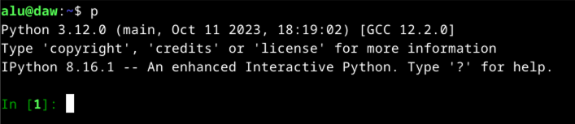
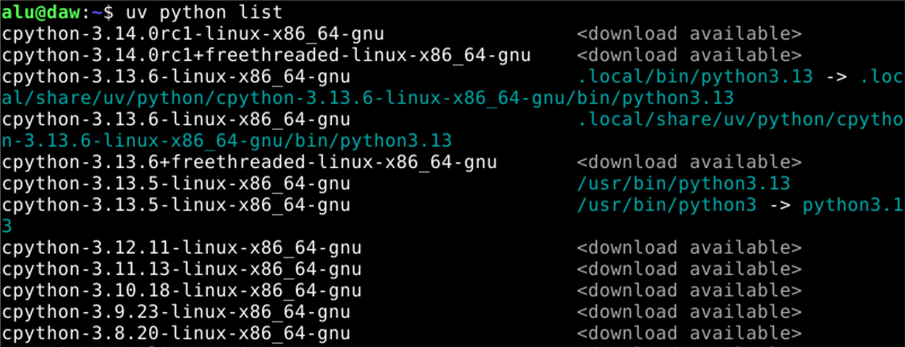
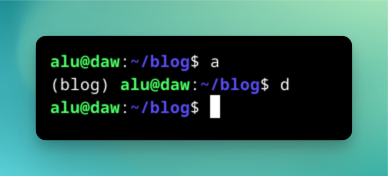
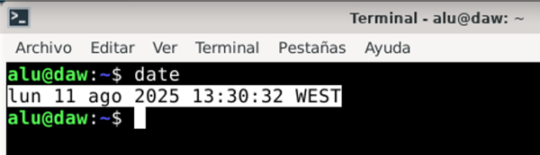

# Características de la máquina virtual <!-- omit from toc -->

- [Configuración](#configuración)
- [Usuarios](#usuarios)
- [Copiar y pegar](#copiar-y-pegar)
- [Manejo de ficheros](#manejo-de-ficheros)
- [Visual Studio Code](#visual-studio-code)
- [Otras herramientas](#otras-herramientas)

## Configuración

La máquina virtual se ha preparado con [VirtualBox 7.1](https://www.virtualbox.org/) y dispone de la siguiente configuración:

- Sistema operativo Linux [Debian 13](https://bits.debian.org/2025/08/trixie-released.html) con escritorio [XFCE](https://www.xfce.org/).
- 4GB de RAM.
- 30GB de disco.
- Interfaz de red en modo puente (_bridge_).

## Usuarios

Se ha creado el usuario `alu` con contraseña `tranquilidad` para el acceso del alumnado a la máquina virtual.

Posteriormente cada alumno/a modificará dicha contraseña a la suya particular.

## Python <!-- omit from toc -->

### iPython <!-- omit from toc -->

Abrir intérprete interactivo de Python (`ipython`):

```console
$ p
```



> [!NOTE]
> Obviamente también se puede lanzar el intérprete interactivo con `python` aunque dispone de menos funcionalidades.

### uv <!-- omit from toc -->

La gestión de las distintas versiones de Python se realiza a través de la herramienta [uv](https://docs.astral.sh/uv/). Esto facilita la instalación de versiones antiguas o modernas del lenguaje aislando cada una del sistema operativo.



### Entornos virtuales <!-- omit from toc -->

Activar el entorno virtual:

```console
$ cd <ruta/al/proyecto>
$ a
```

> 💡 `a` es un alias para `source .venv/bin/activate`

Desactivar el entorno virtual:

```console
$ cd <rutal/al/proyecto>
$ d
```

> 💡 `d` es un alias para `deactivate`

Ejemplo:



### pytest <!-- omit from toc -->

Tenemos ya instalado el paquete [pytest](https://docs.pytest.org/en/7.1.x/getting-started.html) de forma global para lanzar nuestros tests:

```console
$ pytest
```

### pypas <!-- omit from toc -->

También está disponible la herramienta de ejercicios en Python [pypas](https://pypas.es). Recuerda actualizarla a la última versión ejecutando el siguiente comando:

```console
$ pypas upgrade
```

## Copiar y pegar

> Ya está habilitado el portapapeles bidireccional entre la máquina real y la máquina virtual.

Para copiar desde la terminal **basta con seleccionar texto**:



También es posible **copiar el contenido de cualquier fichero** desde línea de comandos con el siguiente comandou

```console
$ copy <fichero>
```

La copia también **funciona si usamos "pipes"** en línea de comandos:

```console
$ cat setup.sh | copy
```

## Manejo de ficheros

Listado de **todos los ficheros con detalles y tamaños en unidades "humanas"** ordenados de más reciente a menos reciente modificación:

```console
$ ll
```


Listado de **todos los ficheros (también ocultos) con detalles y tamaños en unidades "humanas"** ordenados de más reciente a menos reciente modificación:

```console
$ lla
```


Es posible **crear una carpeta y moverse a ella** (todo en uno) utilizando el siguiente comando:

```console
$ take <nueva/ruta>
```


## Visual Studio Code

**Abrir cualquier proyecto** en Visual Studio Code:

```console
$ cd <ruta/al/proyecto>
$ e
```

> 💡 `e` es un alias para `code .`

### Configuración de herramientas Python <!-- omit from toc -->

Las herramientas Python que funcionan dentro de VSCode deben seguir una mínima configuración que se ha preparado en los siguientes archivos de configuración:

- [`~/.config/ruff/ruff.toml`](./files/.ruff.toml)
- [`~/.config/mypy/config`](./files/.mypy.ini)

### Extensiones <!-- omit from toc -->

En Visual Studio Code se han instalado y configurado las siguientes extensiones para **desarrollo con Python**:

- [Ruff](https://marketplace.visualstudio.com/items?itemName=charliermarsh.ruff): analizador de código Python.
- [Mypy](https://marketplace.visualstudio.com/items?itemName=ms-python.mypy-type-checker): verificador de tipos estáticos.
- [Django](https://marketplace.visualstudio.com/items?itemName=batisteo.vscode-django): sintaxis y ayudas con Django.

Adicionalmente se han instalado y configurado las siguientes extensiones para **desarrollo en general**:

- [Just](https://marketplace.visualstudio.com/items?itemName=kokakiwi.vscode-just): gestor de ficheros _justfile_.
- [Prettier](https://marketplace.visualstudio.com/items?itemName=esbenp.prettier-vscode): formateador de distintos tipos de archivo.
- [Markdown Preview Github Styling](https://marketplace.visualstudio.com/items?itemName=bierner.markdown-preview-github-styles): previsualizador de archivos _markdown_ al estilo GitHub.
- [gettext](https://marketplace.visualstudio.com/items?itemName=mrorz.language-gettext): coloreado de sintaxis para ficheros PO de internacionalización.
- [vscode-icons](https://marketplace.visualstudio.com/items?itemName=vscode-icons-team.vscode-icons): conjunto de iconos muy lindos.
- [Open in GitHub](https://marketplace.visualstudio.com/items?itemName=fabiospampinato.vscode-open-in-github): apertura de archivos locales en el repositorio remoto GitHub.

### Ajustes de VSCode <!-- omit from toc -->

Los ajustes de VSCode para una mejor experiencia de desarrollo están en [este archivo](./files/settings.json) y quedan almacenados en la ruta: `~/.config/Code/User/settings.json`.

## Otras herramientas

Las siguientes herramientas ya vienen preinstaladas en la máquina:

- [zip](https://voidnull.es/zip-el-comando-para-comprimir-todo-lo-que-necesites/): Utilidad para comprimir archivos.
- [git](https://git-scm.com/): Sistema distribuido de control de versiones.
- [tree](<https://en.wikipedia.org/wiki/Tree_(command)>): Visualización en árbol del sistema de ficheros.
- [just](https://github.com/casey/just): Herramienta para poder ejecutar comandos predefinidos en proyectos (_makefiles_) → Creado alias `j` para `just`.
- [bat](https://github.com/sharkdp/bat): Es como "cat" pero que mola. ¡Pruébalo!
- [sqlite3](https://www.sqlite.org/index.html): Herramienta cliente en línea de comandos para manejar bases de datos de tipo sqlite.
- [postgresql](https://www.postgresql.org/): Sistema gestor de bases de datos.
- [redis](https://redis.io/): almacenamiento clave-valor en memoria.
- [trans](https://github.com/soimort/translate-shell): Traductor para línea de comandos → Creado alias `t` para traducir del español al inglés.
- [npm](https://www.npmjs.com/): Sistema de gestión de paquetes para Node.js
- [poedit](https://poedit.net/): Utilidad de ayuda a la traducción de cadenas de texto en internacionalización de aplicaciones.
