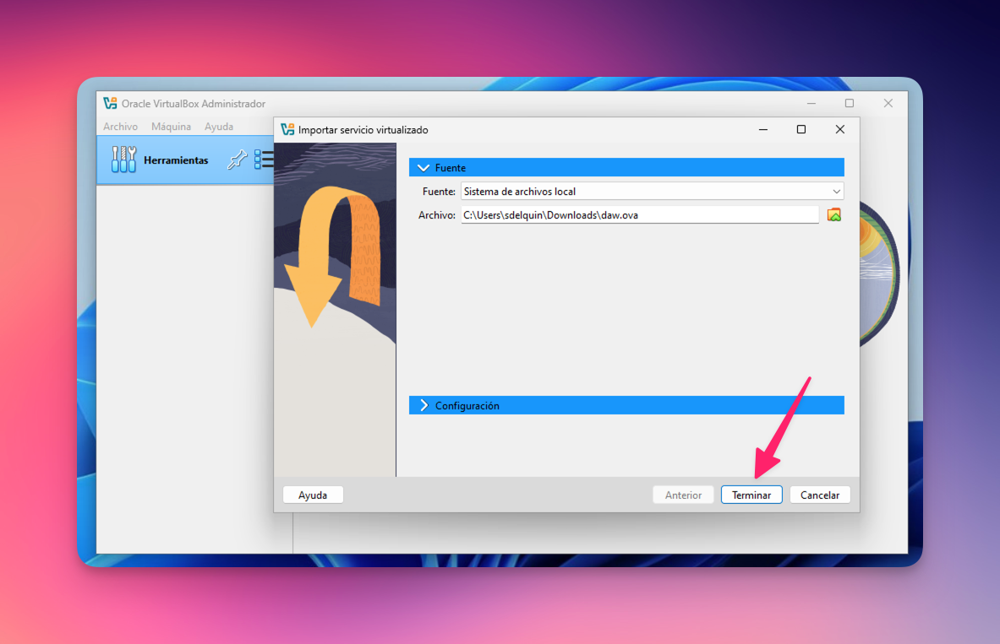
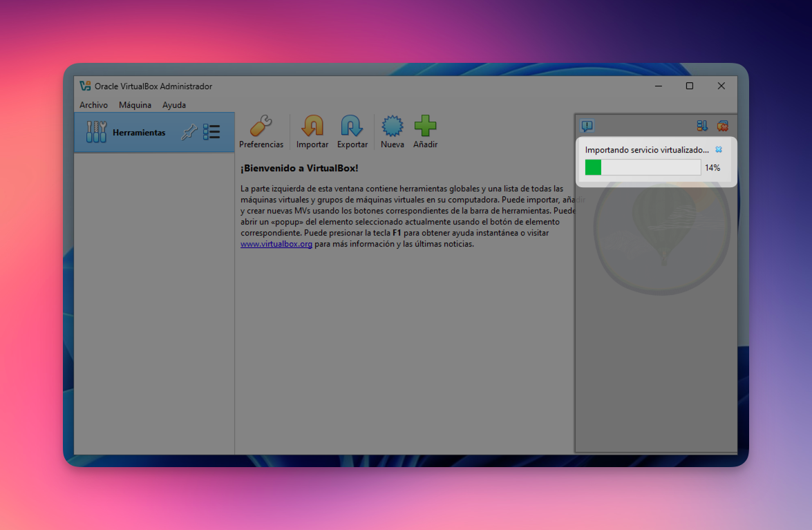
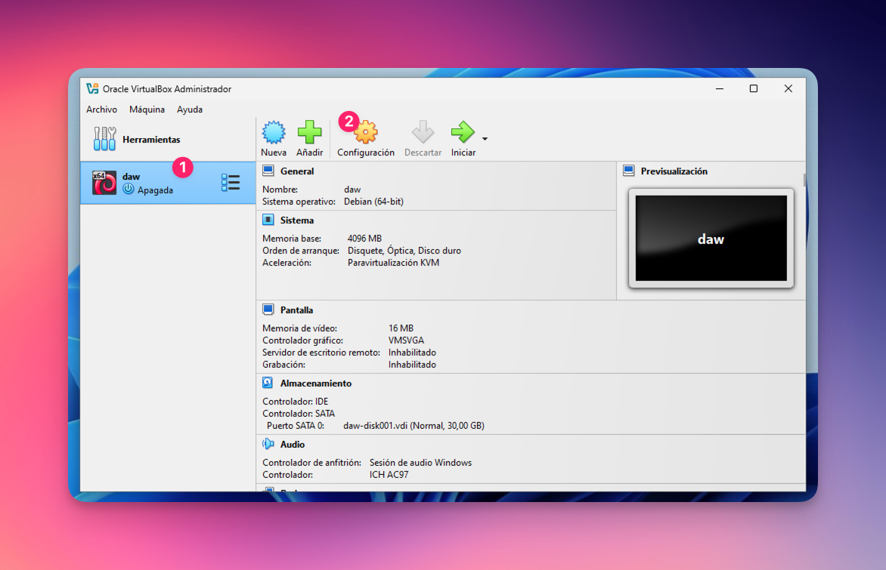
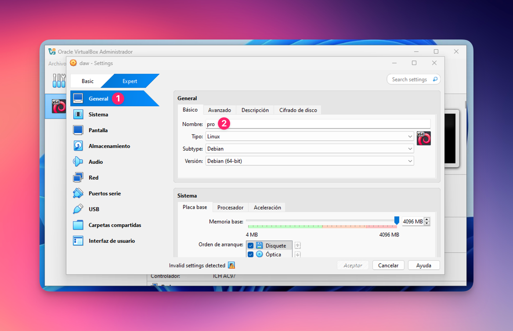
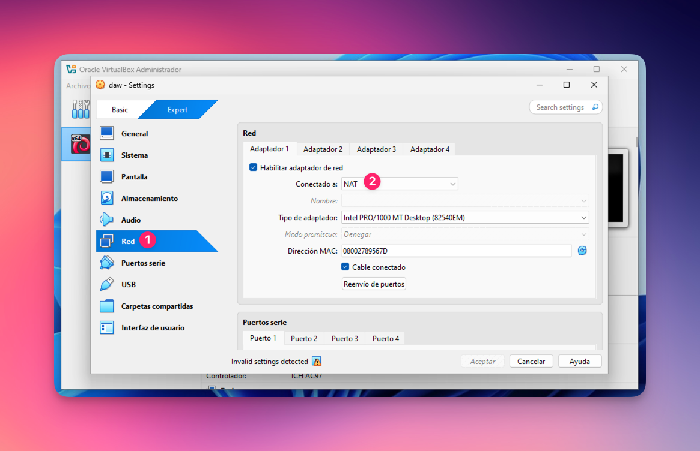
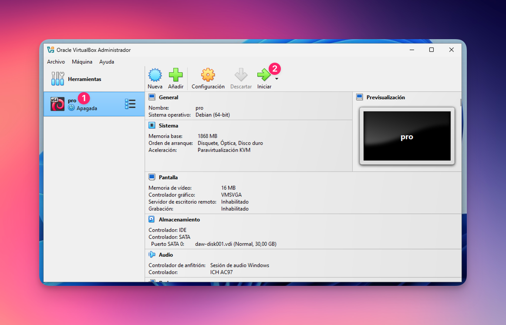

# Configuración de la máquina virtual (EN CASA)

Esta guía explicará el proceso de instalar la máquina virtual en casa, suponiendo que tienes un sistema operativo tipo **Windows**.

## Instalar VirtualBox

1. Descarga [VirtualBox](https://www.virtualbox.org/wiki/Downloads) en tu máquina de casa.
2. Realiza la instalación paso a paso. No es necesario modificar ningún valor predeterminado.

## Descargar la máquina virtual

La máquina virtual se exporta en formato [OVF](https://es.wikipedia.org/wiki/Open_Virtualization_Format).

1. Descarga la máquina virtual desde esta URL: https://g.sdelquin.me/daw-ova
2. Ten paciencia porque el archivo suele ser de varios gigas. Al terminar deberías tener en tu carpeta de descargas un archivo `daw.ova`

## Importar la máquina virtual

1. Haz doble click en el archivo descargado `daw.ova`
2. Esto hará que se abra VirtualBox y aparezca la pantalla para importar máquinas virtuales.

3. Este proceso durará unos minutos:

## Configurar la máquina virtual

1. Ya deberíamos tener una máquina virtual importada con el nombre `daw`. Ahora vamos a abrir su configuración:

2. Le cambiamos el nombre a la máquina virtual según corresponda:

- `pro` si estás cursando «Programación» de 1DAW.
- `dsw` si estás cursando «Desarrollo web en entorno servidor» de 2DAW.

3. Modificamos la configuración de red a NAT:

4. Pusamos el botón de <kbd>ACEPTAR</kbd>.

## Iniciar la máquina virtual

Ahora sólo nos queda iniciar la máquina virtual:

