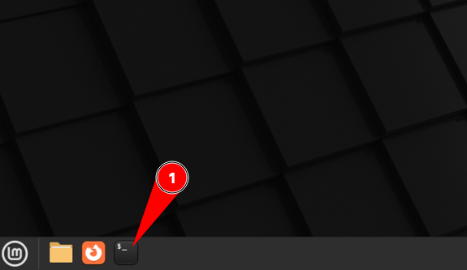
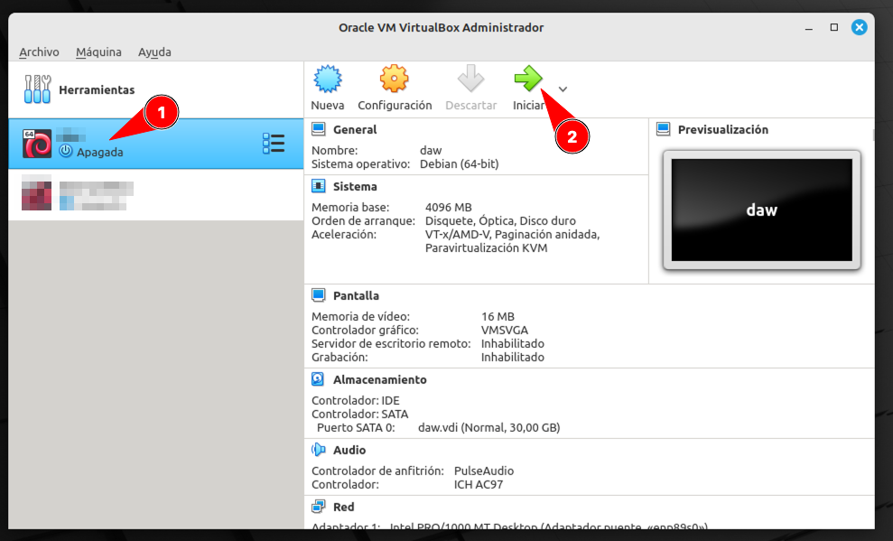
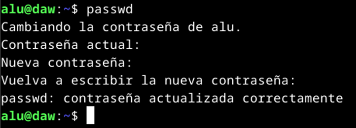
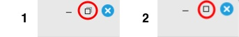

# Configuración de la máquina virtual

Esta sección explica cómo montar **la máquina virtual** con la que vamos a trabajar en clase.

[Descarga e instalación](#descarga-e-instalación)  
[Arranque y configuración](#arranque-y-configuración)  
[Clave de acceso](#clave-de-acceso)  
[Observaciones](#observaciones)

## Descarga e instalación

Abrimos una terminal **desde la máquina real**:



Construimos la máquina virtual con el siguiente comando:

```console
curl -sL https://raw.githubusercontent.com/sdelquin/edubase/main/scripts/build-vm.sh | bash
```

> ⚠️ Este proceso puede durar varios minutos. ¡Paciencia!

Ajustamos los parámetros de la interfaz de red con el siguiente comando:

```console
curl -sL https://raw.githubusercontent.com/sdelquin/edubase/main/scripts/fix-network.sh | bash
```

## Arranque y configuración

Ahora abrimos VirtualBox:


Debería aparecer **una nueva máquina virtual con el nombre del módulo**. Arrancamos esta máquina:



En pocos segundos nos aparecerá la **ventana de login**:


Accedemos al sistema con las siguientes credenciales:

- Usuario: `alu`
- Contraseña: `tranquilidad`

A continuación abrimos una terminal **desde la máquina virtual**:


Lanzamos el siguiente comando para fijar el nombre de máquina (_hostname_):

```console
curl -sL https://raw.githubusercontent.com/sdelquin/edubase/main/scripts/set-hostname.sh | bash
```

> ⚠️ Cuando nos lo solicite tendremos que poner la contraseña (ojo porque no se ve cuando la escribimos).

A continuación creamos las carpetas de trabajo en el HOME del usuario ejecutando la siguiente instrucción:

```console
curl -sL https://raw.githubusercontent.com/sdelquin/edubase/main/scripts/create-folders.sh | bash
```

## Clave de acceso

Por último **modificamos la contraseña** que está por defecto para el usuario `alu` poniendo otra distinta QUE NO DEBEMOS OLVIDAR.

Para ello ejecutamos el comando `passwd`:



## Observaciones

1. La primera vez que entramos a la máquina virtual puede que no se vea ocupando completamente la pantalla. Esto lo resolvemos muy fácil:



2. Abre una terminal y lanza el siguiente comando para comprobar que tu IP se corresponde con la que debe:

```console
ip -br a | perl -nle 'print $1 if /(10.[^\/]+)/'
```

Ejemplos:

- Si estás en el aula 103 y tu número de PC es el 7, el comando debería dar como salida: `10.103.7.20`
- Si estás en el aula 109 y tu número de PC es el 4, el comando debería dar como salida: `10.109.4.20`

> 💡 Si la IP que saca el comando no es la que corresponda, avisa al profe.

3. No instales otra shell que no sea la que viene por defecto `bash` ya que puede afectar a las configuraciones predefinidas.

## ⚠️ SÓLO PARA CAMBIO DE PUESTO

En caso de que te hayas cambiado de puesto en clase, debes ejecutar los siguientes comandos.

### Desde una terminal de ➡️ LA MÁQUINA REAL ⬅️

Cerramos la máquina virtual (en caso de que estuviera abierta) y **abrimos una terminal en la máquina real**:


Ajustamos los parámetros de la interfaz de red ejecutando el siguiente comando:

```console
curl -sL https://raw.githubusercontent.com/sdelquin/edubase/main/scripts/fix-network.sh | bash
```

### Desde una terminal de ➡️ LA MÁQUINA VIRTUAL ⬅️

Arrancamos la máquina virtual y **abrimos una terminal en la máquina virtual**:


Ajustamos el nombre de máquina ejecutando el siguiente comando:

```console
curl -sL https://raw.githubusercontent.com/sdelquin/edubase/main/scripts/set-hostname.sh | bash
```

## ⚠️ Cuando usamos la máquina en casa

Cuando nos llevamos la máquina virtual a casa es muy probable que la configuración de red nos de problemas ya que no va a encontrar la misma interfaz de red que en el centro.

**Es por ello que se recomienda, siempre que empecemos a trabajar en el centro, lanzar el siguiente comando DESDE UNA TERMINAL DE LA MÁQUINA REAL**:

```console
curl -sL https://raw.githubusercontent.com/sdelquin/edubase/main/scripts/fix-network.sh | bash
```

Ahora ya podremos iniciar la máquina virtual con normalidad.
