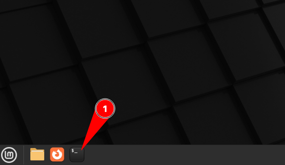
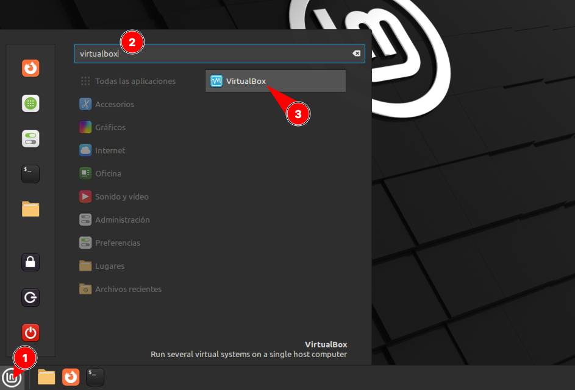
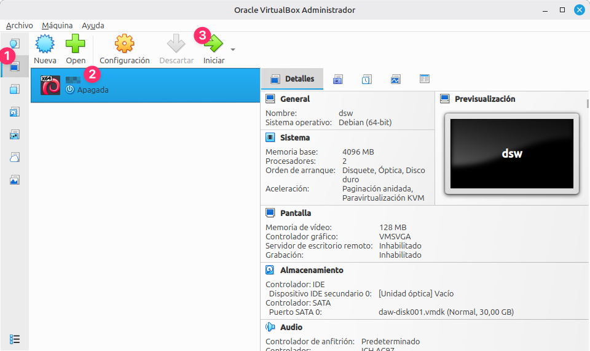
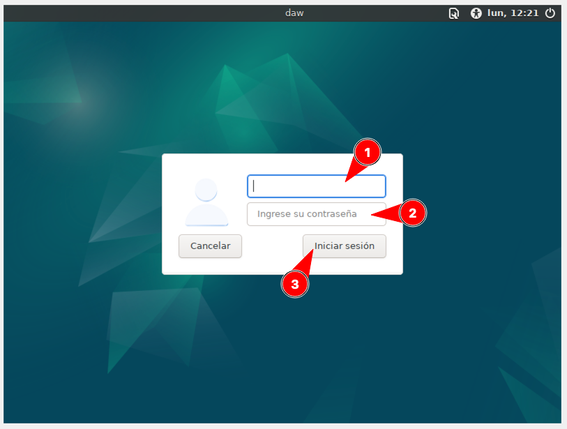
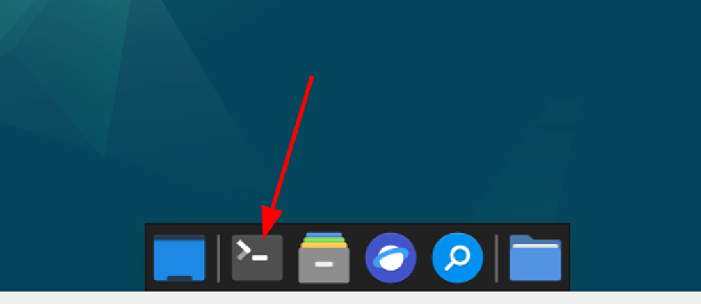
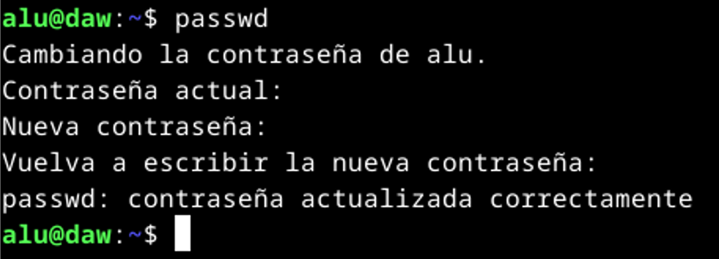
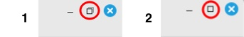
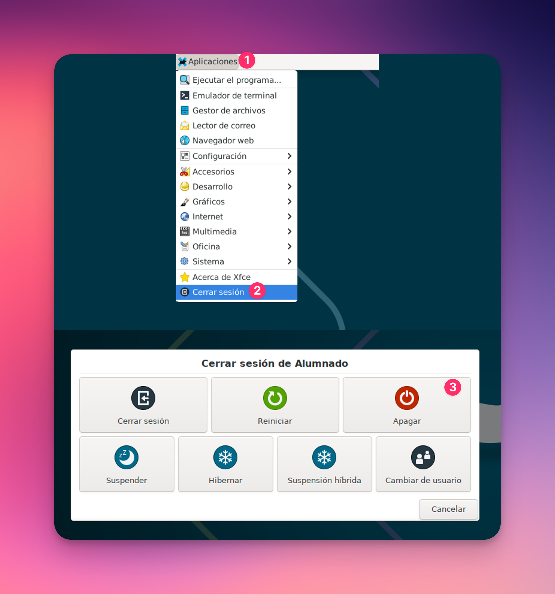
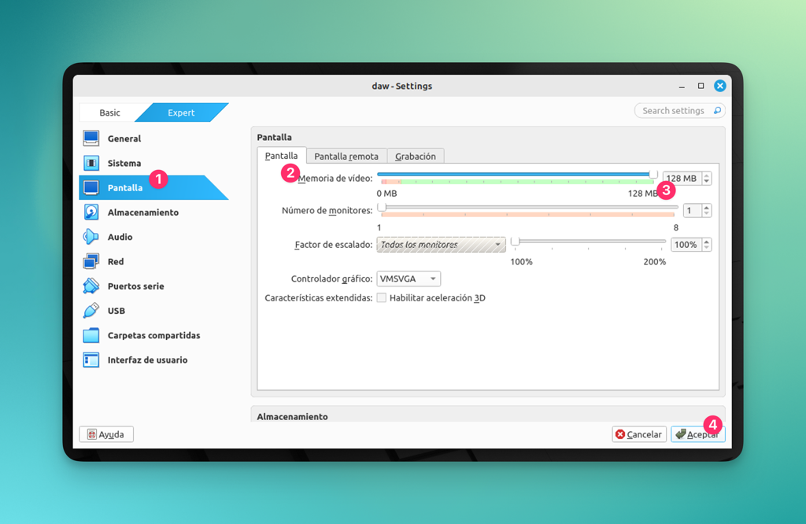

# Configuración de la máquina virtual

Esta sección explica cómo montar **la máquina virtual** con la que vamos a trabajar en clase.

[Descarga e instalación](#descarga-e-instalación)  
[Arranque y configuración](#arranque-y-configuración)  
[Clave de acceso](#clave-de-acceso)  
[Pasos posteriores](#pasos-posteriores)  
[Advertencias](#advertencias)  
[Apagar la máquina virtual](#apagar-la-máquina-virtual)

## Descarga e instalación ⬇️

Abrimos una terminal **desde la máquina real**:



Construimos la máquina virtual pegando y ejecutando (con <kbd>ENTER</kbd>) el siguiente comando en la terminal:

> [!TIP]
> Para copiar puedes usar el símbolo ⧉ que está a la derecha del comando. Para pegar en la terminal tendrás que usar la combinación de teclas <kbd>CTRL+SHIFT+V</kbd> (o botón derecho → pegar)

```console
bash <(curl -fsSL https://raw.githubusercontent.com/sdelquin/edubase/main/scripts/build-vm.sh)
```

> [!IMPORTANT]
> Este proceso puede durar varios minutos. ¡Paciencia!

### Interfaz de red

Es bastante probable que la interfaz de red que tiene configurada la máquina virtual no coincida con la de la máquina real.

Para solucionar esto ejecuta el siguiente comando (**desde una terminal de la máquina real**):

```console
bash <(curl -fsSL https://raw.githubusercontent.com/sdelquin/edubase/main/scripts/fix-netiface.sh)
```

> [!TIP]
> Si no aparece nada tras ejecutar el comando, son buenas noticias.

## Arranque y configuración ⚙️

Ahora abrimos **VirtualBox**:



Debería aparecer **una nueva máquina virtual con el nombre del módulo**. Arrancamos esta máquina:



En pocos segundos nos aparecerá la **ventana de login**:



Accedemos al sistema con las siguientes credenciales:

- Usuario: `alu`
- Contraseña: `tranquilidad`

A continuación abrimos una terminal **desde la MÁQUINA VIRTUAL**:



## Clave de acceso

Por último **modificamos la contraseña** que está por defecto para el usuario `alu` poniendo otra distinta **QUE NO DEBEMOS OLVIDAR**.

Para ello ejecutamos (desde una terminal de la **MÁQUINA VIRTUAL**) el comando `passwd`:



> [!TIP]
> Cuando escribas verás que no aparece nada en pantalla pero realmente **sí se está pasando la información**.

## Pasos posteriores 👣

### A toda pantalla

La primera vez que entramos en la máquina virtual puede que no se vea ocupando completamente la pantalla. Esto lo resolvemos muy fácil:



### Comprobación de la configuración de red

Abre una terminal (en la máquina virtual) y lanza el siguiente comando para comprobar que tu IP se corresponde con la que debe:

```console
ip -br a | perl -nle 'print $1 if /(10.[^\/]+)/'
```

Ejemplos:

- Si estás en el **aula 103** el resultado del comando (IP) debería ser algo como: `10.103.99.X`
- Si estás en el **aula 109** el resultado del comando (IP) debería ser algo como: `10.109.99.X`

## Advertencias 🚨

1. **NO MODIFIQUES EL NOMBRE DE LA MÁQUINA VIRTUAL**. Debe llamarse tal y como quedó después de la configuración inicial.
2. **NO MODIFIQUES LA CUENTA DE USUARIO** que se ha creado por defecto `alu`.
3. **NO INSTALES OTRA SHELL** que no sea la que viene por defecto `bash` ya que puede afectar a las configuraciones de distintas herramientas.

## Apagar la máquina virtual 🔌

Para apagar la máquina virtual sigue estos pasos:



## Problemas con cursor del ratón

Si tu ratón aparece **con un cuadrado** en la máquina virtual, es posible que se solucione subiendo la memoria de vídeo en VirtualBox.

Accede a la configuración de la máquina virtual y modifica este parámetro:


