# Instalación de VSCode en Windows

Antes que nada tendremos que [descargar el instalador de VSCode](https://code.visualstudio.com/download) desde su página oficial:

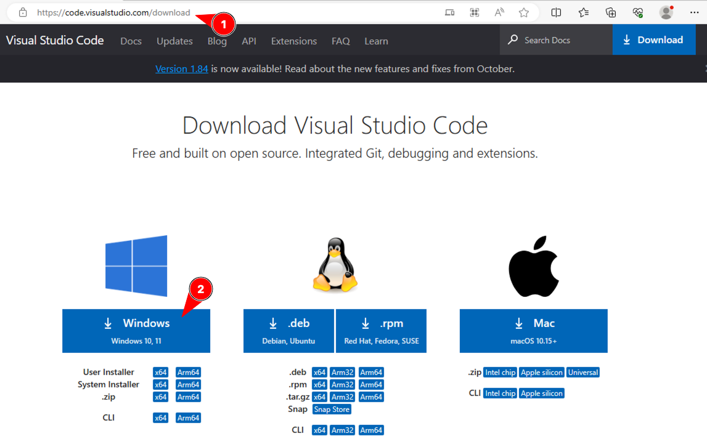

Puede que aparezca un mensaje de seguridad. Conservamos el archivo:

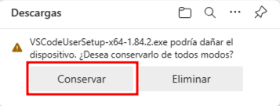

Lo más habitual es que el fichero se haya guardado en la carpeta de _Descargas_. Lo buscamos en el explorador de archivos y hacemos doble clic sobre el archivo:

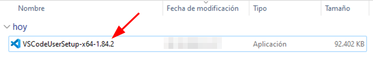

Si aparece una pantalla de seguridad podemos ejecutar con normalidad:

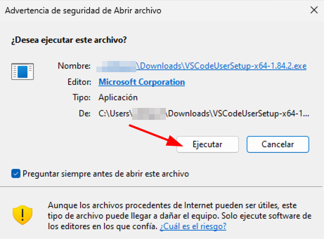

A continuación se nos pedirá aceptar la licencia de uso:

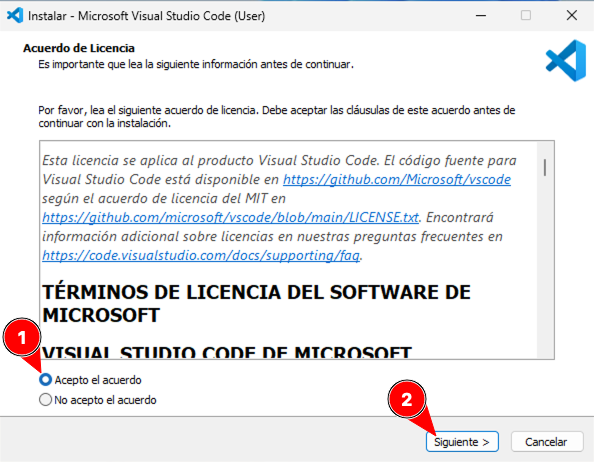

En la siguiente pantalla tendremos que seleccionar la carpeta de destino. Dejamos los valores por defecto y continuamos:

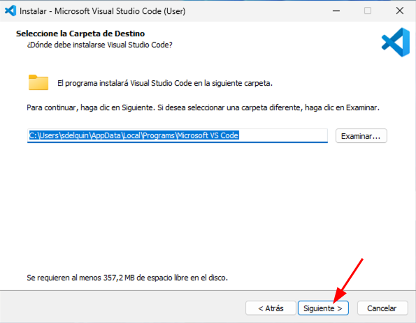

A continuación habrá que definir la carpeta del menú inicio. Dejamos los valores por defecto y continuamos:

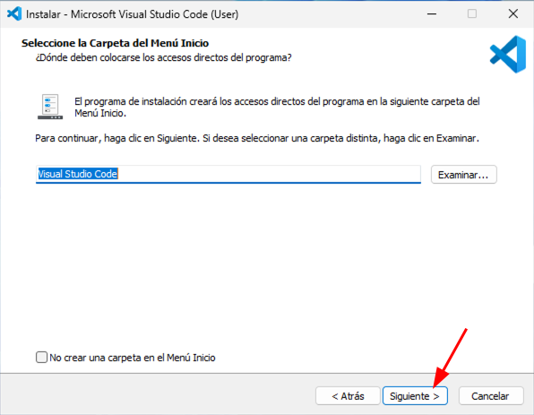

En la siguiente pantalla hay que seleccionar las tareas adicionales. **Marcamos las siguientes opciones** y continuamos:

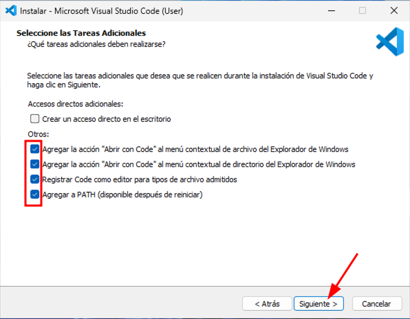

Llegamos a la pantalla final para lanzar la instalación:

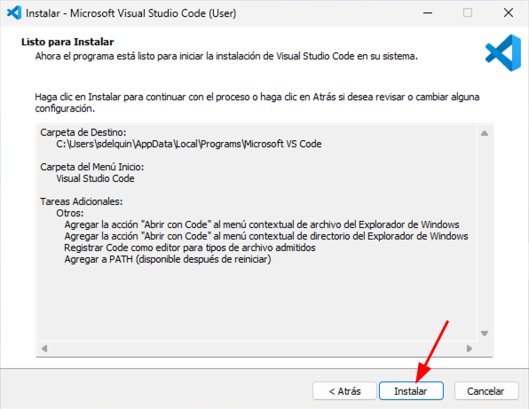

Nos aparecerá una barra de progreso a medida que se van instalando los distintos componentes:

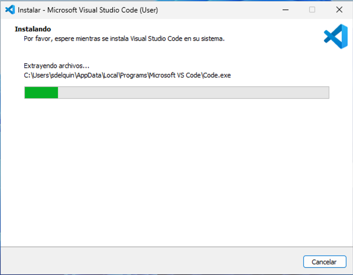

Finalmente nos aparecerá la siguiente pantalla indicando que VSCode se ha instalado correctamente. Al finalizar se nos abrirá la aplicación:

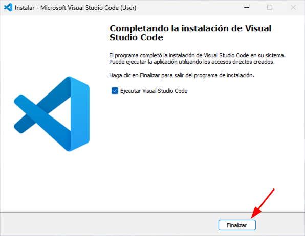

Deberíamos ver una pantalla similar a esta:

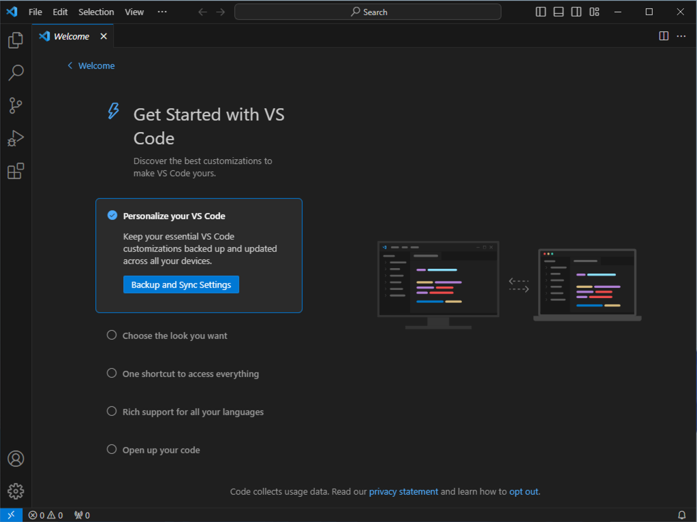
